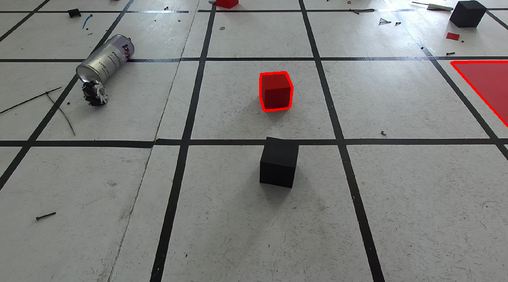

##Integration

For detecting colors using OpenCV, we calibrate de color red, blue, green and yellow with HSV color code and then we detect the color of the cube using the a range of values for each color, using the following code:

```python
import cv2
import numpy as np

def dibujar(mask,color):
    contornos,_ = cv2.findContours(mask, cv2.RETR_EXTERNAL,cv2.CHAIN_APPROX_SIMPLE)
    for c in contornos:
        area = cv2.contourArea(c)
        if area > 3000:
            M = cv2.moments(c)
            if (M["m00"]): M["m00"] = 1
            x = int(M["m10"]/M["m00"])
            y = int(M['m01']/M["m00"])
            nuevoContorno = cv2.convexHull(c)
            #print (nuevoContorno[0][1], nuevoContorno[1], nuevoContorno[2], nuevoContorno[3])

            x, y, w, h = cv2.boundingRect(c)
            xmin = x
            ymin = y
            xmax = x + w
            ymax = y + h
            print('xmin:', xmin, 'ymin:', ymin, 'xmax:', xmax, 'ymax:', ymax)
            print ("acabeeeeeeeeee")
            #cv2.circle(frame,(x,y),7,(0,255,0),-1)  
            #cv2.putText(frame,'{},{}'.format(x,y), (x+10,y), font, 0.75,(0,255,0),1,cv2.LINE_AA)

            if color == (255,0,0):
                print('azul')
            if color == (0,255,0):
                print('verde')
            if color == (0,0,255):
                print('rojo')   
            if color == (0,255,255):
                print('Amarillo')
            cv2.drawContours(frame,[nuevoContorno],0,color,3)


cap = cv2.VideoCapture(0)

redBajo1 = np.array([0,150,45],np.uint8)
redAlto1 = np.array([5,255,200],np.uint8)

redBajo2 = np.array([170,100,45],np.uint8)
redAlto2 = np.array([179,255,255],np.uint8)

azulBajo = np.array([110,130,45],np.uint8)
azulAlto = np.array([125,255,255],np.uint8)

verdeBajo = np.array([50,100,20],np.uint8)
verdeAlto = np.array([80,255,255],np.uint8)

amarillobajo = np.array([15,100,20],np.uint8)
amarilloalto = np.array([45,255,255],np.uint8) 

font = cv2.FONT_HERSHEY_SIMPLEX
while True:
    ret,frame = cap.read()
    if ret == True:
        frameHSV = cv2.cvtColor(frame,cv2.COLOR_BGR2HSV)
        maskAzul = cv2.inRange(frameHSV,azulBajo,azulAlto)
        maskVerde = cv2.inRange(frameHSV,verdeBajo,verdeAlto)
        maskamarillo = cv2.inRange(frameHSV,amarillobajo, amarilloalto)
        maskRed1 = cv2.inRange(frameHSV,redBajo1, redAlto1)
        maskRed2 = cv2.inRange(frameHSV,redBajo2, redAlto2)
        maskred = cv2.add(maskRed1,maskRed2)
        dibujar(maskAzul,(255,0,0))
        dibujar(maskamarillo,(0,255,255))
        dibujar(maskVerde,(0,255,0))
        dibujar(maskred,(0,0,255))
        frame = cv2.resize(frame, (0, 0), fx = 0.3, fy = 0.3)
        cv2.imshow('frame',frame)
        if cv2.waitKey(1) & 0xFF == ord('s'):
            break
cap.release()
cv2.destroyAllWindows()
```


 