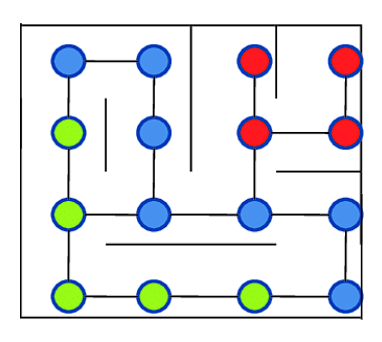
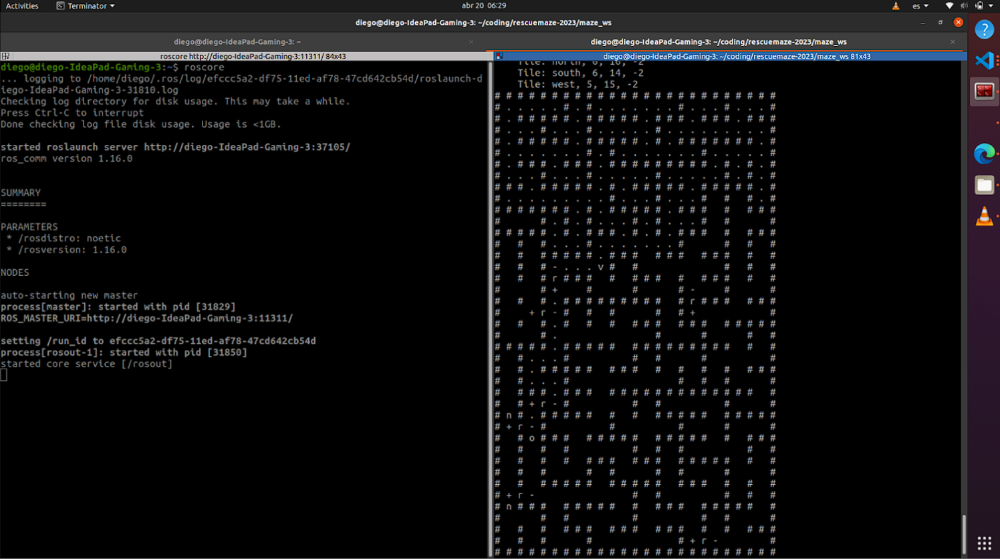

# Algorithm
The maze solving algorithm is based on some famous algorithms like __Breadth First Search__ (BFS) and __Dijkstra's shorthest path__  and is coded in _C++_.

The algorithm's main goal is to explore all of the maze in the most efficient way, storing victims and obstacles in a map. And returning to the starting tile at the end. 

## Tiles
The algorithm's main unit is the __tile__, where each one has different properties depending on what's physically in there, like black / blue tiles, victims, stairs, ramps, adjacent tiles or walls, which are then used in other processes. There are also properties related to the robot's exploration, like position relative to the robot's starting point in terms of x, y and z, properties defining if a tile has already been visited or if the robot knows if something is in the tile, as well as a weight value that determines the cost to go to that tile.

## Map
The algorithm uses a __graph__, a data structure that contains different nodes that can have connections to other nodes. In this case, the nodes are the different tiles and the connections are the physical space between them, so a connection exists if the tiles are adjacent to each other. This data structure was chosen for its flexibility, since it can be scaled freely as the robot explores, without having limits on the size of the map.  
There isn't a specific interface for the graph, instead it is embedded in the tiles, using __pointers__ to have a current tile at all times, as well as a _std::map_ in the tiles that has the pointers to the adjacent tiles in each of the four directions. There's also another _std::map_ at the top level that relates a position to the corresponding tile's pointer, added for a faster lookup. 

## Engine
At the start of the execution it assigns the current direction to the north and uses that as a __reference__ for the map. It also initializes relevant variables (_map of tiles, first tile, unvisited tiles vector_). At every new tile it checks for victims, and stores them if there are, so as to not give additional kits if it passes the victim again. 
It then checks the walls on the 4 directions, and if there's no wall it checks if there isn't an existing tile in the adjacent position. If there's an existing tile it appends it to the current tile to avoid __duplication__, and if there isn't one, it makes a new one and adds it to the vector with the unvisited tiles. This is where the inspiration from the BFS algorithm comes from, since it uses a queue to know the next objectives, but this isn't efficient, since it would do a lot of __backtracking__. To solve this it uses Dijkstra's algorithm.

## Dijkstra's Shortest Path
This algorithm helps when trying to find the shortest path to __any__ number of nodes in a graph from a __starting node__. This specific implementation takes in a starting position in a graph and the list of unvisited tiles. The process of the algorithm involves keeping track of the best path and cost for each tile, as well as a local "visited" parameter. It starts in the starting position given to the function and assigns it a cost of 0, and then starts checking the adjacent tiles, comparing the cost to go there from the current position (cost of current tile + weight of adjacent tile) to the current cost value of that tile. If it's lower it updates the cost and path, which would be the current tile. Then it checks for the tile with the lowest cost that has not been visited in the scope of the function. It then repeats the process after all accessible tiles have been visited.

The finished product of this loop is the best path and cost for each tile.
Also, during the loop there's a variable that keeps track of the __best unvisited tile__ in the scope of the main engine, which is only updated when it's cost is higher than the current one and the current tile is part of the unvisited tiles list.
Having the best next tile, it only needs to know the path it needs to take to go there, which is obtained from the path variable, where it uses a grasp of __recursion__, since the path would be the path to go to the adjacent tile plus a movement to get there. And to actually do that it goes backwards, adding movements to a _stack_, and then updating the tile to the previous one in the path.

