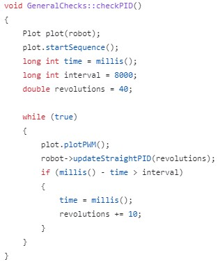
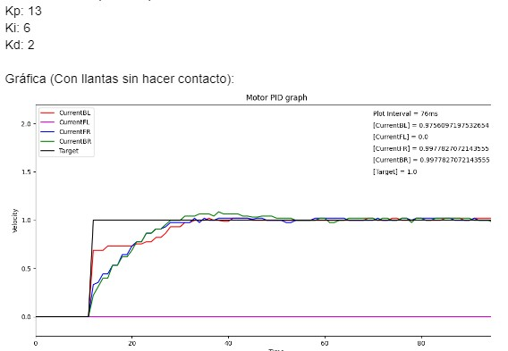
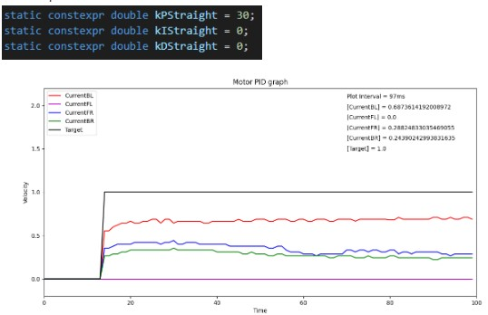

# PID

The PID was used to approach target RPMs for the motors. The RPM targets were increased or diminished depending on the error between the current angle and angle of the desired orientation.

The PID controller recieved feedback of the motor's speed from the encoders: while rotating, each motor takes a specific amount of pulses to complete a full rotation. The encoders update a counter each time a pulse is detected, and the PID controller uses this information to calculate current RPMs, which determines if the PWM of each specific motor should be increased or decreased to achieve the target. 

The PID controller has 3 constants: Kp, Ki, and Kd that indicate how much importance should be given to the proportional, integral, and derivative terms, respectively. These constants were tuned manually to achieve the desired performance.

See PID implementation [here](https://github.com/RoBorregos/rescuemaze-2023/blob/pidrotation/navSensors/main_code/PIDRb.h).
See examples of calls to the PID object [here](https://github.com/RoBorregos/rescuemaze-2023/blob/pidrotation/navSensors/main_code/Motor.cpp) (notice the calls to attachInterrput, used for encoders). See how to count encoder pulses [here](https://github.com/RoBorregos/rescuemaze-2023/blob/pidrotation/navSensors/main_code/Encoder.h).

## Examples of tuning PID constants

To visualize the effectiveness of the PID controller, the [following code](https://github.com/RoBorregos/rescuemaze-2023/blob/pidrotation/navSensors/other/multiplePlots.py) was used to plot the RPS of the motors and the target RPS. To use the script:

1. Set the appropriate COM port in multplePlots.py
2. Close serial monitors from Arduino IDE (otherwise, serial communication will fail)
3. Remove all serial.print() calls from the Arduino code (otherwise, serial communication will fail)
4. From the arduino, call a routine similar to this:

Where robot is an instance of [Movement](https://github.com/RoBorregos/rescuemaze-2023/blob/pidrotation/navSensors/main_code/Movement.h) and [Plot](https://github.com/RoBorregos/rescuemaze-2023/blob/pidrotation/navSensors/main_code/Plot.h) is a class that handles serial communication and plotting. A method to update the motors movement should also be called. In this example, [updateStraightPID(RPMs)](https://github.com/RoBorregos/rescuemaze-2023/blob/pidrotation/navSensors/main_code/Movement.cpp#L552) updates the data and state of the motor, which is sent through serial by the plot class.

### Examples of graphs given kp, ki, kd constants

**Example 1**

**Example 2**

