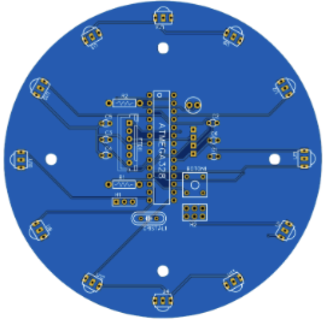

# IR ring

To track the ball, we reused a custom PCB design from previous team members, which incorporated 12 TSSP58038 infrared receivers arranged in a circular ring to provide full 360-degree coverage around the robot. These receivers were connected to an ATmega328P microcontroller, which handled signal processing and calculated the angle of the ball relative to the robot’s front. Each IR receiver was tuned to detect the 38 kHz modulated infrared signal emitted by the ball. The ATmega328P processed these inputs to determine which receivers registered the strongest signal, calculated a directional vector toward the ball, and transmitted this information via UART to the main controller. The angle was reported within a range of -180 to +180 degrees, enabling precise tracking of the ball’s position. During assembly take into account that the IR ring should be clear of obstructions, such as wires or structural components, that might block or distort the infrared signals.

