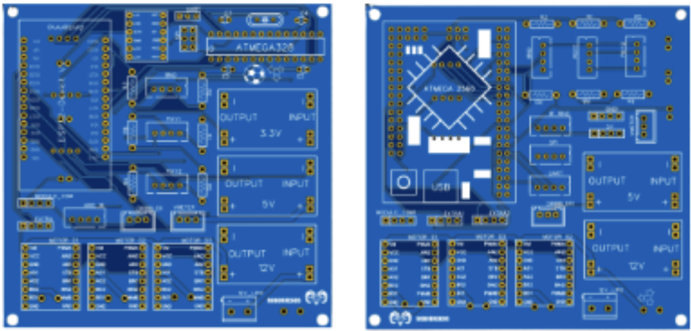

# Main controller and PCB

Our initial main PCB design was based on an **ESP32 microcontroller**, chosen to take advantage of its high processing power, built-in Wi-Fi and Bluetooth for potential inter-robot communication, and flexibility for implementing advanced features in the future. The ESP32 was intended to handle high-level control and decision-making, while a separate **Atmega328P** managed data acquisition from the line-sensing phototransistors. The two controllers communicated using UART, a simple serial protocol that allowed us to modularize and separate tasks cleanly. The entire PCB was designed using EasyEDA, which facilitated both the layout process and manufacturing.

Although this setup seemed ideal in theory, in practice we encountered several limitations. The ESP32 did not provide enough GPIO pins to connect all of our sensors, drivers, and peripherals without adding complexity, such as additional multiplexers and level shifters. Integration also took longer than expected; the introduction of communication links between controllers added new debugging challenges that we did not have sufficient time to fully resolve during the build phase. While the ESP32 offered faster processing capabilities, we found that the performance was unnecessary for our simpler sensing and decision-making requirements. 

Ultimately, we decided to switch to an Arduino Mega Pro as our main controller. This board provided a simpler, more reliable integration process which helped us stay on schedule.
This supported rapid prototyping and iterative development. Even after our main PCB was fabricated, the Mega Pro’s pin layout and accessibility made it easy to modify connections, reroute signals, and test alternative configurations as we refined the robot’s design. This flexibility allowed us to respond quickly to integration issues and implement last-minute improvements without needing to redesign or remanufacture the entire PCB

