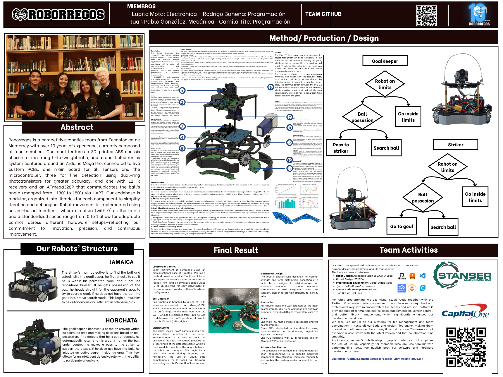

# Soccer Lightweight 2025

### Team members
Lupita Mota - Electronics  
Juan Pablo González - Mechanics  
Rodrigo Bahena - Programming  
Camila Tite - Programming  

### Abstract
Our robot features a 3D-printed ABS chassis chosen for its strength-to-weight ratio, and a robust electronics system centered around an Arduino Mega Pro, connected to five custom PCBs: one main board for all sensors and the microcontroller, three for line detection using dual-ring phototransistors for greater accuracy, and one with 12 IR receivers and an ATmega328P that communicates the ball’s angle (mapped from -180° to 180°) via UART. 
 
Our codebase is modular, organized into libraries for each component to simplify iteration and debugging. Robot movement is implemented using cosine-based functions, where direction (with 0° as the front) and a standardized speed range from 0 to 1 allow for adaptable control across different hardware setups.

