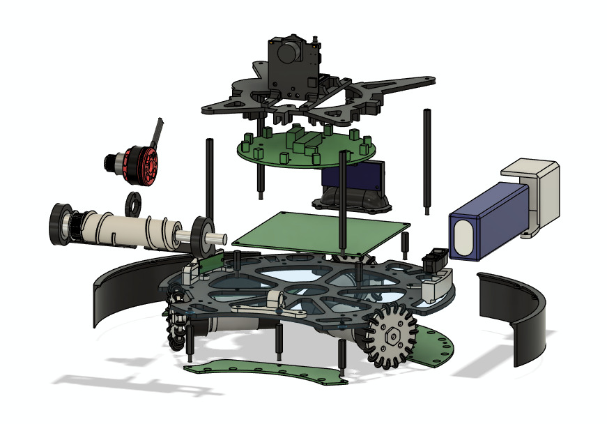

# Mechanic design

- [Early CAD](https://a360.co/44nkMS7)

- [Final CAD](https://a360.co/4iSOiTq)

### For next year

- Focus on developing a design that doesn’t interfere with the IR sensors.
- Add a bottom layer to the chassis to protect the phototransistor PCBs.

