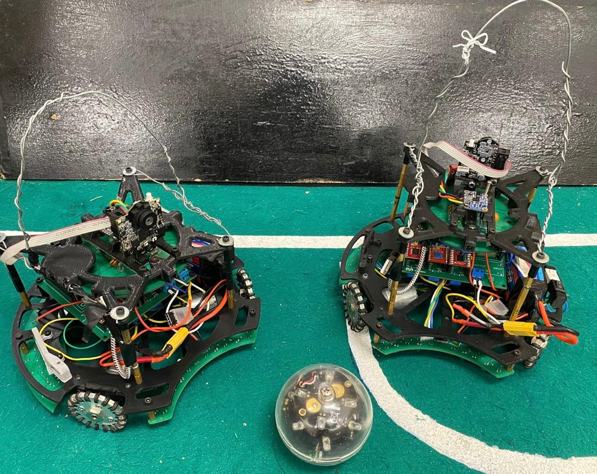

# General

We structured our codebase into modular libraries and used GitHub to support collaborative development. Each library corresponds to a specific hardware component, which improves code readability and contributes to a more maintainable and scalable system. This modular approach has also allowed us to debug efficiently and make quick adjustments when needed.

For programming the robots, we use Visual Studio Code along with the PlatformIO extension. This setup provides a more organized and professional environment for working with microcontrollers such as Teensy and Arduino. PlatformIO offers multi-board support, code autocompletion, integrated version control, and efficient library management—all of which significantly streamline our development workflow.

GitHub serves as our central platform for version control, file sharing, and team coordination. It hosts all our software and hardware files, making them easily accessible to every team member regardless of time or location. This ensures everyone is always working with the most up-to-date versions and helps maintain smooth collaboration across the team.

Additionally, we use GitHub Desktop, a graphical interface that simplifies Git workflows—especially for members less familiar with command-line tools. We use it to publish and manage both our software and hardware development.

Link: [GitHub Repository](https://github.com/RoBorregos/Soccer-Lightweight-2025.git)

## Tools

The main tools used to program the robot are:

-Visual Studio Code (IDE with the PlatformIO extension)
-Pixymon (Software used to configure the Pixy Camera)

## Strategy

As part of our strategy, we deployed two specialized robots: one for offense and one for defense.
The attacking robot used an IR ring to track the ball by following its infrared signals. With the assistance of the camera, it calculated the angle to the opponent’s goal and navigated in that direction to attempt a score. Phototransistor plates were used to prevent the robot from entering the goal area.

For the defending robot, the camera was oriented toward our own goal. It was also equipped with an ultrasonic sensor. Working together, the camera and sensor defined a movement zone, allowing the robot to track and follow the ball within a limited defensive area.

## Algorithm

### **Attacking Robot**

### **Defending Robot**