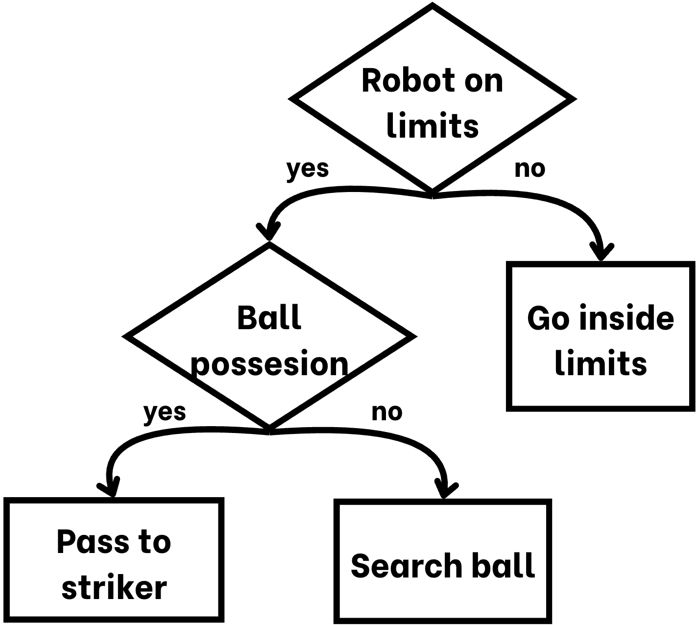
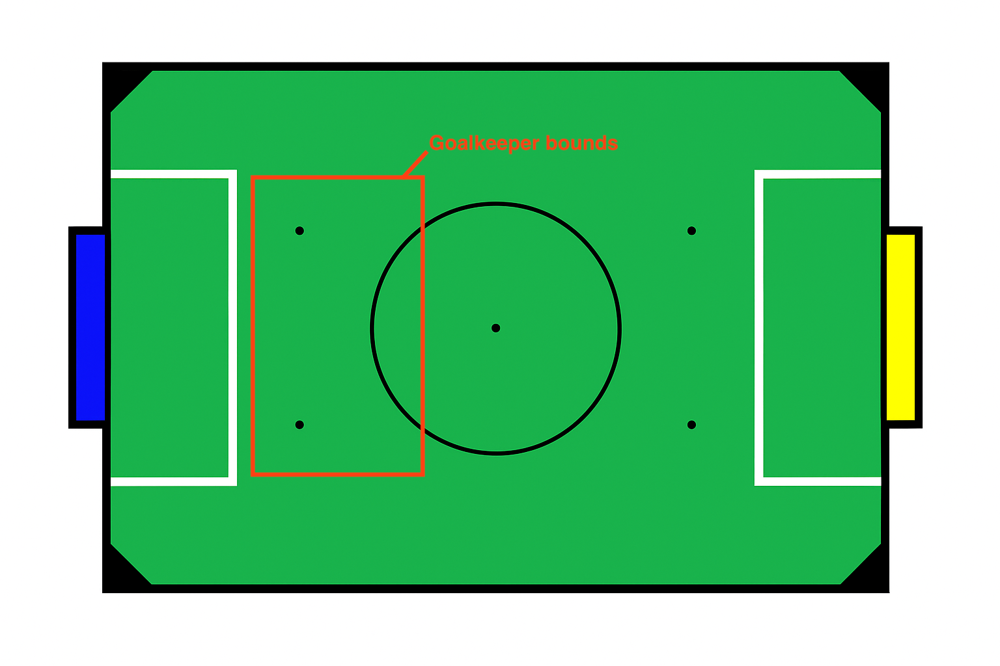
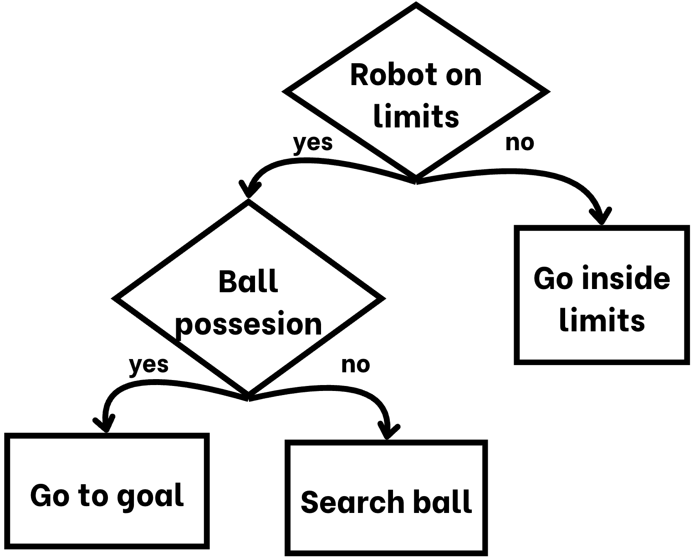

# General

We structured our codebase into modular libraries and used GitHub to support collaborative development. Each library corresponds to a specific hardware component, which improves code readability and contributes to a more maintainable and scalable system. This modular approach has also allowed us to debug efficiently and make quick adjustments when needed.

For programming the robots, we use Visual Studio Code along with the PlatformIO extension. This setup provides a more organized and professional environment for working with microcontrollers such as Teensy and Arduino. We suggest to read our documentation on how did we use platformIO on our GitHub Repository

GitHub serves as our central platform for version control, file sharing, and team coordination. It hosts all our software and hardware files, making them easily accessible to every team member regardless of time or location. This ensures everyone is always working with the most up-to-date versions and helps maintain smooth collaboration across the team. Also it helped for mentors to check our updates on software development for the contest

Link: [GitHub Repository](https://github.com/RoBorregos/Soccer-Lightweight-2025.git)

## Tools

The main tools used to program the robot are:

-Visual Studio Code (IDE with the PlatformIO extension)  
-Pixymon (Software used to configure the Pixy Camera)

# Strategy

As part of our strategy, we deployed two robots: one for offense and one for defense.
The attacking robot used an IR ring to track the ball by following its infrared signals. With the assistance of the camera, it calculated the angle to the opponent’s goal and navigated in that direction to attempt a score. Phototransistor plates were used to prevent the robot from entering the goal area.

For the defending robot, the camera was oriented toward our own goal. It was also equipped with an ultrasonic sensor on the back of the robot. Working together, the camera and sensor defined a movement zone, allowing the robot to track and follow the ball within a limited defensive area.

---
## Horchata (Defender)🥛

Our defending robot was programmed to operate within a defined zone on the field. This area was limited both horizontally and vertically to ensure it stayed close to the goal and maintained an effective defensive position.

To define the vertical boundaries, the robot used an ultrasonic sensor that measured its distance from the back wall of the field. Based on this reading, it was restricted to move only between a minimum and maximum distance—ensuring it didn’t get too close to the goal or drift too far forward.

For the horizontal boundaries, we used data from the camera. A custom function allowed the robot to determine its angle relative to the goal. Using this information, it was limited to move only within a certain angular range, preventing it from straying too far left or right. We also created a method to get the horizontal distance frmo the center of the goal to the robot, althrought we percibed it was more precise, the readding of the data was slower.

Together, these constraints formed a kind of virtual rectangle or box within which the robot could move. Inside this area, it used its IR ring to follow the infrared signals emitted by the ball, allowing it to track and react to the game while staying in position.

## Jamaica (Striker)🍹

The striker’s main objective is to locate the ball and attack. Unlike the goalkeeper, the striker does not operate within a fixed area. Instead, it constantly checks that it is not crossing the field boundaries using phototransistor plates placed underneath the robot. If a boundary line is detected, the robot adjusts its position to stay within the playing field.

The striker follows a state machine to manage its behavior. Initially, it enters a search state, using its IR ring to detect the ball. Once it locates the ball, it evaluates the angle between its forward direction and the ball; if this angle is 10° or less, the robot assumes it has possession.

Upon gaining possession, it transitions to an attack state. It uses a camera to determine the angle to the opponent’s goal and adjusts its movement accordingly, heading straight toward the goal. To ensure a valid score, the striker is programmed to stop just before entering the goal area, using the front phototransistors to detect the boundary line and avoid crossing it entirely.

## Algorithm
