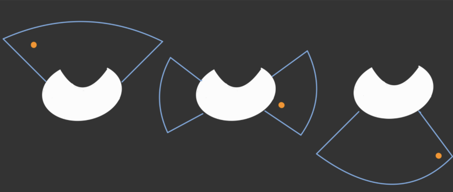

# Ball Detection – IR Ring
Ball tracking is managed by a ring of 12 infrared (IR) receivers arranged in a circular configuration and connected to a dedicated ATmega328P microcontroller. This system allows the robot to detect the angle and strength of the infrared signal emitted by the ball, which contains IR LEDs. The ATmega328P processes the signals from the IR sensors and communicates the calculated ball angle and signal strength to the main controller via UART.

The angle is mapped in the range of -180° to 180°, where 0° represents the front of the robot, negative values indicate the ball is to the right, and positive values to the left. This angular data is used to orient the robot towards the ball with high precision.

To improve the stability of the readings, the system uses the `SingleEMAFilterLib` library, which applies an Exponential Moving Average (EMA) filter. This smooths out noise and sudden changes in the sensor data.

We obtained two different values:
- `Angle`: the angle of the ball relative to the front of the robot
- `Strength`: indicates how close the ball is to the robot. Since we didn’t get consistent values, we decided not to use this method.

To develop the board and code for the IR Ring, information was taken from this website: [IR Ring](https://yunit.techblog.jp/archives/86422131.html) 

## Implementations
First, the `UpdateData()` method receives the information sent by the IR ring microcontroller.

We have a method called `GetRawAngle()` which simply returns the original ball angle in the range of -180° to 180°:

```cpp
double IRRing::GetRawAngle()
{
    if(angle > 180){
        angle -= 360;
    }
    return angle;
}
```
Then, we have GetAngle(), which provides the final value we use as a parameter for the robot’s movement direction.

We adjust the angle using different offsets based on how far the ball is from the front:

- Larger angles (ball behind) get a bigger offset (1.1 – 1.5),
- Medium angles (ball to the side) use a medium offset (1.03 – 1.099),
- Smaller angles (ball in front) use a smaller offset (0.8 – 1.0).

```cpp
    if (abs(angle) > 52){
    angle = angle * ballFollowOffsetBack;
    } else if (abs(angle) < 52 && abs(angle) > 25){
    angle = angle * ballFollowOffsetSide;
    } else if (abs(angle) < 25){
    angle = angle * ballFollowOffsetFront;
    } else {
    angle = angle;
    }
```
This allows for a more precise approach to the ball depending on its position.


During testing, we noticed that sensors sometimes gave false readings or had blind spots, which affected the robot's movements. To fix this, we added a final filter before using the ball angle value:

```cpp
    if (angle > 0.05 || angle <= -0.05){
        lastBallAngle = angle;
    } else if (angle <= 0.05 || angle >= -0.05) {
        angle = lastBallAngle; 
    }  
```
This is because when the sensors fail to detect the ball, they return a false value of 0.00.

--- 

# How does the code works

### 1. Reading the IR Sensors `sensor_control.cpp` and `sensor_control.h` on the IR Ring Microcontroller
Main function: Read the IR signal strength from each of the 12 sensors placed around the robot.

How does it work?

Pin definition:
In `SensorPins[IR_NUM]`, the pins connected to the 12 IR sensors are defined.

Direct reading:
The function `getSensorPin(uint8_t pin)` reads each sensor's state using direct register access for higher speed.

Pulse measurement:
The `getAllSensorPulseWidth` function measures how long each sensor detects the IR signal during a time window `(timeLimit)`. This gives an idea of the signal strength each sensor receives.

Vector assignment:
Each sensor has an associated unit vector `(unitVectorX, unitVectorY)` representing its angular position around the robot.

Resultant vector calculation:
`calcVectorXYFromPulseWidth` multiplies the intensity of each sensor by its unit vector and sums all of them to get a final vector pointing in the direction of the strongest IR signal.

Conversion to angle:
`calcRTfromXY` converts the final Cartesian vector into polar coordinates `(radius and angle)`, where the angle `(theta)` indicates the ball’s direction relative to the robot.

### 2. Signal Filtering and Processing `IRRing.cpp` and `IRRing.h` on the Main Microcontroller
Main function: Filter and adjust the detected angle to get a stable and useful reading for robot control.

How does it work?

Data reception:
The `UpdateData()` method receives data via UART through the serial port from the ring microcontroller in the format "a <value>" for angle or "r <value>" for strength.

Filtering:
An exponential filter `(SingleEMAFilter)` is used to smooth both the angle and strength, reducing noise and fast fluctuations.

Offset adjustment:
The `SetOffset` method allows you to correct the base angle to compensate for physical misalignments of the sensor.

Corrected angle calculation:
The `GetAngle` method applies different correction factors depending on whether the ball is in front, to the side, or behind the robot. This enables more accurate control. If the angle is very small (less than 0.5), the last meaningful value is kept to avoid sudden changes when the signal is weak.

### Data Flow Summary
1. The IR sensors detect the ball’s signal and measure its strength in every direction.
2. A final vector is calculated that points to the strongest direction.
3. That vector is converted into an angle relative to the robot.
4. The angle is filtered and adjusted to provide a stable and usable value for robot control.

## What is the EMA filter and how is it used here?
The EMA filter **(Exponential Moving Average)** is a digital filtering technique that smooths noisy signals. It's very useful in robotics to get stable readings from sensors. In this code, it’s used to filter both the angle and the strength of the IR signal detected by the robot.

#### 1. How is it implemented in the code?

  1. Creating the filter
In the `IRRing.cpp` file:

```cpp
SingleEMAFilter<double> filterAngle(0.6);
SingleEMAFilter<double> filterStr(0.6);
```
This creates two **EMA filters**: one for the angle and one for the strength, both with an alpha value of 0.6.

`alpha = 0.6` means the filter gives 60% weight to the new value and 40% to the previous filtered value.

  2. Applying the filter. 
Every time a new angle or strength value is received:

```cpp
filterAngle.AddValue(angle);
filterStr.AddValue(strength);
```
This updates the internal filtered value of each filter.

  3. Using the filtered values
For strength, the `GetStrength()` method returns the smoothed value:

```cpp
double IRRing::GetStrength(){
    return filterStr.GetLowPass();
}
```
For angle, although the filter is updated, the filtered value is not directly used in `GetAngle()`, but it could be used to get an even more stable angle.

#### 2. How does the filter work internally?  
The filter is implemented in `SingleEMAFilterLib.h`:

```cpp
_lowPassFilter = alpha * value + (1 - alpha) * _lowPassFilter;
_lowPassFilter is the previously filtered value.
```
`value` is the new incoming data.

`alpha` controls how fast the filter reacts.

#### 3. Interpretation:

If `alpha` is high **(close to 1)**, the filter reacts quickly but smooths less.

If `alpha` is low **(close to 0)**, the filter reacts slowly but smooths more (ideal for removing noise).

#### 4. Why is this filtering important for the robot?

  1. Removes spikes and jumps:  
  IR signals can be noisy due to interference, reflections, or fast fluctuations. The **EMA filter** removes these spikes so the robot doesn’t react to random noise.

  2. Improves stability:  
  The robot can follow the ball more smoothly and precisely, since the movement commands are based on stable data.

  3. Prevents false detections:  
  Especially important for strength, where low and noisy readings might make the robot “lose” the ball temporarily.

#### 5. Key filter functions

  1. `AddValue(value)`:
Applies the filter and updates the internal value.

  2. `GetLowPass()`:
Returns the smoothed (filtered) value.

  3. `GetHighPass()`:
Returns the fast-changing part of the signal (not used in the code, but useful to detect sudden changes).

#### 6. Visual summary

```cpp
SingleEMAFilter<double> filter(0.6);
double filteredAngle = filter.AddValue(rawAngle);
double filteredStrength = filterStr.AddValue(rawStrength);
```
Every time we receive new data, we pass it through the filter before using it.
This way, the control decisions are based on stable and reliable data.

The **EMA filter** in the this is essential for the robot to correctly interpret the direction and strength of the IR signal from the ball, avoiding erratic movements and improving tracking accuracy.