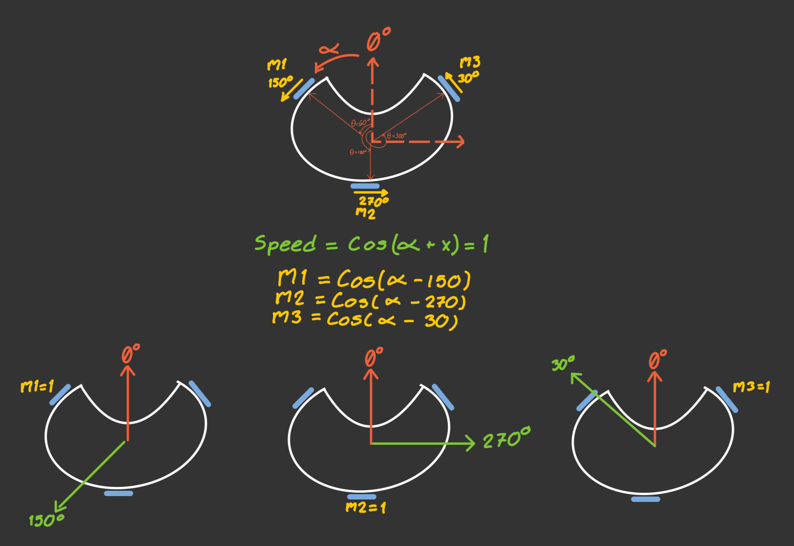
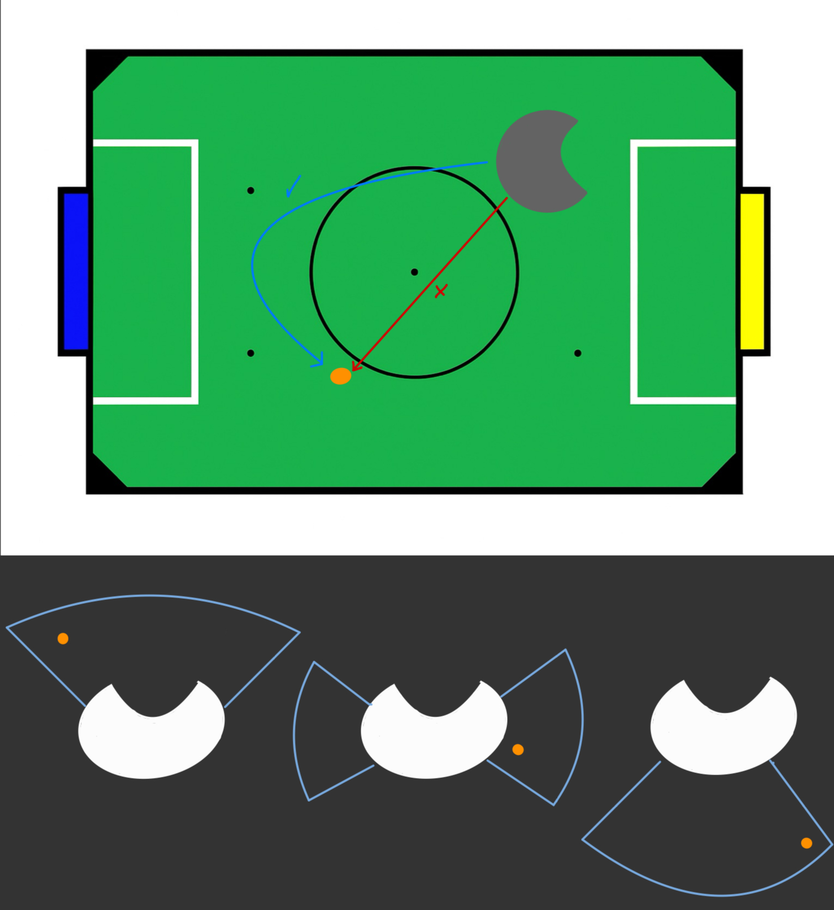

# Motion Control

The robot’s movement system is based on a three-motor omnidirectional base, allowing it to move in any direction without needing to rotate first. This flexibility is crucial for quick responses and smooth navigation in dynamic environments, such as robotic competitions.

## Velocity Equations for an Omnidirectional Base


To obtain the equations that describe the motion of an omnidirectional base, we start by analyzing the velocity components using cosine functions. In this model, the value `1` represents the maximum speed a motor can reach in the forward direction, while `-1` represents the same speed in the opposite direction.

Our motors are placed with an angular separation of 120°, located at 60°, 180°, and 300° with respect to the center of the base. Since the wheels are mounted perpendicular to the axis of each motor, the resulting direction of motion for each wheel (when the motor spins positively) is:

- **Motor m1**: 150°  
- **Motor m2**: 270°  
- **Motor m3**: 30°

To calculate the speed of each motor depending on the desired direction of movement of the robot, we use the following general expression:

`v = cos(α - x)`

Where:

- `α` is the direction we want the robot to move (parameter we'll introduce),
- `x` is the direction in which each motor contributes movement (Value we need to find),
- `v` is the normalized speed of motor, with values between `-1` and `1`.

This formula works because when `α = x`, the cosine is maximum (`cos(0) = 1`), meaning the motor should spin at its full speed in the positive direction to contribute fully to that movement. Using this idea, we find:

- If `α = 150°`, motor **m1** should move at full speed:

  - v1 = cos(150° - 150°) = cos(0°) = 1

- If `α = 270°`, motor **m2** should move at full speed:

  - v2 = cos(270° - 270°) = cos(0°) = 1

- If `α = 30°`, motor **m3** should move at full speed:

  - v3 = cos(30° - 30°) = cos(0°) = 1

So, the final speed equations for each motor, based on the desired movement direction `α`, are:

- v1 = cos(α - 150°)  
- v2 = cos(α - 270°)  
- v3 = cos(α - 30°)

These equations tell us how fast each motor should spin to move the robot in a specific direction.

Finally, these normalized values can be multiplied by the linear speed we want for the robot, We used parameters from 0 to 1 to have a standarized code and manage the values of speed in terms of percentage. We can also add an angular speed component, calculated using a PID controller.

To compute each motor’s speed, we use the following method:

```cpp
void Motors::MoveOmnidirectionalBase(double degree, float speed, double speed_w)
{
    float upper_left_speed = cos(((degree - 150) * PI / 180)) * speed + speed_w;
    float lower_center_speed = cos(((degree - 270) * PI / 180)) * speed + speed_w;
    float upper_right_speed = cos(((degree - 30) * PI / 180)) * speed + speed_w;
}
```

These speed values are then passed to the SetSpeed() method of each motor, which handles the direction and PWM-based speed control:

```cpp
void Motor::SetSpeed(float speed) {
    if (speed >= 0) { 
        MovePositive();
    } else {
        MoveNegative();
    }
    speed = abs(speed);
    speed = speed * kMaxPWM;
    if (speed > kMaxPWM) {
        speed = kMaxPWM;
    }
    analogWrite(inPWM_, speed);
}
```
Each motor is managed through an H-bridge configuration using two digital pins (in1, in2) for direction and one PWM pin (inPWM) for speed modulation. This allows for precise bidirectional control of each motor.

## PID Control

As part of our strategy, we wanted our robot to always face the opponent's goal. To achieve this and have better control over the omnidirectional base movement, we implemented a PID controller. This provides corrective feedback for precise alignment and rotational control.

To obtain the error, we used an IMU. Aligned with the front of the robot, the IMU automatically defines the front as the 0° angle when it powers on. As the robot rotates, the difference between the current orientation and the setpoint (0°) becomes the error used in the PID calculation:

```cpp
double control = kp_ * error + ki_ * sum_error + kd_ * delta_error;
```
This value is added to the speed calculation for each motor as `speed_w`.

During testing, we noticed that the IMU was automatically resetting due to vibrations from the robot. To fix this, make sure to initialize the sensor using the correct mode:

```cpp
bno.begin(OPERATION_MODE_IMUPLUS)
```
In the context of a PID controller, **binary search** can be used to find the optimal value of each constant.

Let’s say the ideal value of `P` is somewhere between `0 and 10` (to define this range, you first test a low value and then a high one). 

Then, you try the middle value, for example `P = 5`, and observe how the system behaves. If increasing `P` improves the system, you continue searching in the upper half of the range (between `5 and 10`). If the performance gets worse, you search in the lower half (between `0 and 5`). You repeat this process, reducing the range by half each time, until you find the value that gives the best performance. The same method can be used for the other two constants.

It’s very important to tune each value separately. First, make sure that `P` is high enough to correct the error, but not so high that it causes oscillations or leaves too much error uncorrected. Once `P` performs well, you can tune `I`, which helps reduce steady-state error more precisely. Finally, you adjust `D`, which helps reduce oscillations and improves the overall stability of the system.

## Aproach to ball
To have good control of the ball, we wanted our robot to always approach the ball with its front facing it. To achieve this, we needed to perform a curved trajectory instead of moving directly in the ball's direction.

We applied three different offsets depending on the angle at which the ball was located relative to the front of the robot. Each offset took the ball’s angle and altered it so the robot would move in the direction of the angle plus the offset.

The offsets were used as parameters in the `GetAngle()` method of the **IR Ring class**, and the value it returned was then used as the argument for the `MoveOmnidirectionalBase()` method.
```cpp
double IRRing::GetAngle(float ballFollowOffsetBack, float ballFollowOffsetSide, float ballFollowOffsetFront)
{
    if (abs(angle) > 52){
    angle = angle * ballFollowOffsetBack;
    } else if (abs(angle) < 52 && abs(angle) > 25){
    angle = angle * ballFollowOffsetSide;
    } else if (abs(angle) < 25){
    angle = angle * ballFollowOffsetFront;
    } else {
    angle = angle;
    }

return angle;
}
```


## Switch for motors

A manual switch-based safety mechanism was implemented. When the switch is turned off, all motors are stopped immediately until the switch is reactivated, ensuring user safety during testing or handling.

We add the following method at the beggining of the loop

```cpp
void Motors::StartStopMotors(uint8_t switchPin)
{
    if (digitalRead(switchPin) == HIGH) {
        Serial.println("Switch off. Stopping motors...");
        StopAllMotors(); // Stop all motors
        while (digitalRead(switchPin) == HIGH) {
            // Stay on bucle until switch turns on again
        }
        Serial.println("Switch activated. Restarting...");
    }
}
```
We strongly recomend NOT TO APPLY this strategy, instead, integrate the switch in hardware/electronic design. 
