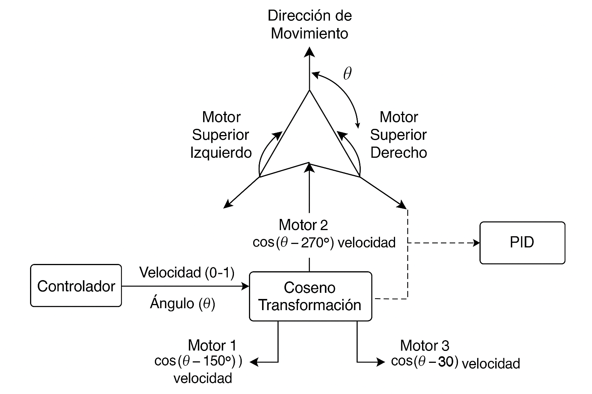
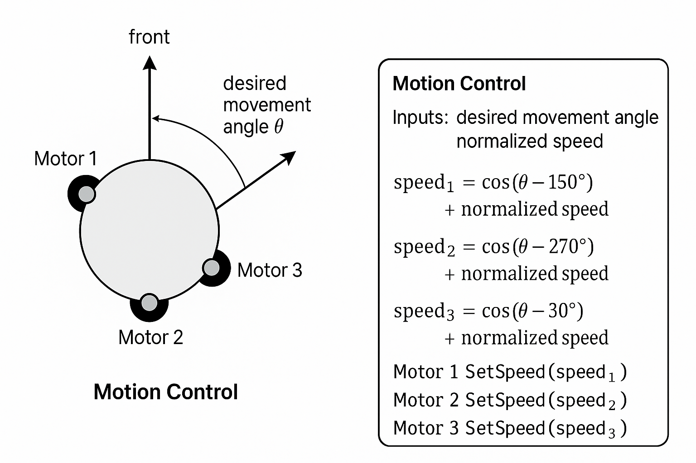

# Motion Control


The robot’s movement system is based on a three-motor omnidirectional base, allowing it to move in any direction without needing to rotate first. This flexibility is crucial for quick responses and smooth navigation in dynamic environments, such as robotic competitions.

To compute each motor’s speed, we use a cosine-based control method. The system takes two primary inputs:

The desired movement angle (relative to the robot's forward direction),

A normalized linear speed value (ranging from 0 to 1).

Using these inputs, the speed for each motor is calculated with cosine transformations shifted by specific angles (150°, 270°, and 30° respectively), allowing for proper distribution of motion across the base:

```cpp
float upper_left_speed  = cos(((degree - 150) * PI / 180)) * speed + speed_w;
float lower_center_speed = cos(((degree - 270) * PI / 180)) * speed + speed_w;
float upper_right_speed = cos(((degree - 30) * PI / 180)) * speed + speed_w;
```


These speed values are then passed to the SetSpeed() method of each motor, which handles the direction and PWM-based speed control:
```cpp
void Motor::SetSpeed(float speed) {
    if (speed >= 0) MovePositive();
    else MoveNegative();

    speed = abs(speed) * kMaxPWM;
    speed = constrain(speed, 0, kMaxPWM);
    analogWrite(inPWM_, speed);
}
```
Each motor is managed through an H-bridge configuration using two digital pins (in1, in2) for direction and one PWM pin (inPWM) for speed modulation. This allows for precise bidirectional control of each motor.

Additionally, a manual switch-based safety mechanism is implemented. When the switch is turned off, all motors are stopped immediately until the switch is reactivated, ensuring user safety during testing or handling.

The robot can also benefit from a PID controller, which adds correctional feedback for precise alignment or rotation control, particularly when working in conjunction with a gyroscope or IMU:

```cpp
double control = kp_ * error + ki_ * sum_error + kd_ * delta_error;
```
