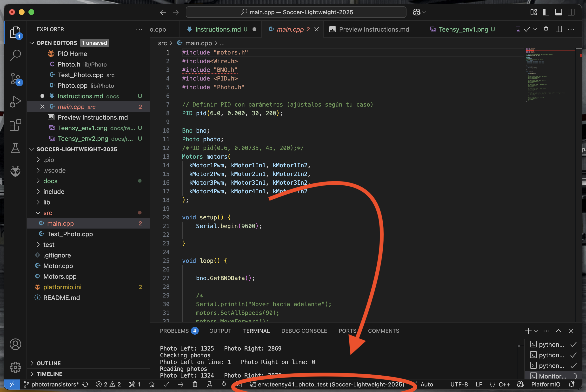
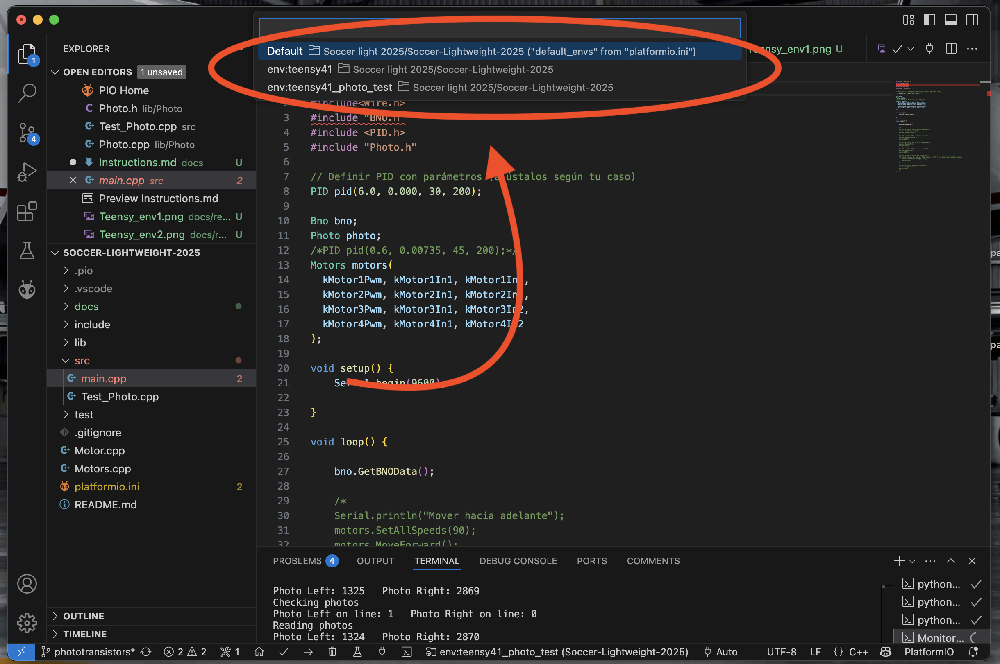
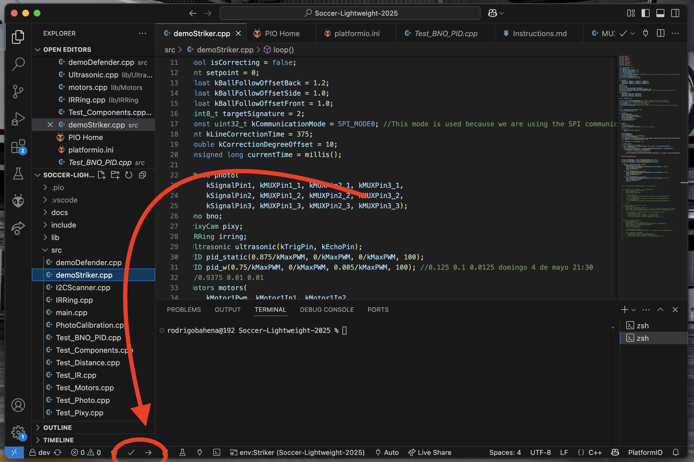

# platformIO - VSCode extension

### ***Note: If you want to explore this and more info, check [the oficial platformIO documentation](https://docs.platformio.org/en/latest/what-is-platformio.html)***

PlatformIO is an extension for VSCode that turns the editor into an IDE for programming microcontrollers. With this tool, we can program directly from VSCode, have better version control using Git and GitHub, and organize our code in a more structured way.

To organize the code, PlatformIO uses the following structure:  
- `platformio.ini`: PlatformIO configuration file. This is where you define the board, environment, libraries, serial monitor speed, and other settings.

- `lib/`: Folder where custom libraries for each component are stored.

It's important to mention that inside the `lib/` folder, you should create a subfolder for each library.
Example:  

<pre> 
SoccerLightweight  
│ 
├── lib/  
    ├── Ultrasonic/  
    │   ├── Ultrasonic.h           
    │   └── Ultrasonic.cpp            
    └── Motors/
        ├── Motors.h           
        └── Motors.cpp   
</pre>    

- `src/`: Folder where the source files to be uploaded to the microcontroller are located, typically the `main.cpp` file.
As part of our strategy, we developed different code files to test each sensor individually, as well as a main program for the goalkeeper and another for the striker.


## How to have many main.cpp files to test different codes into de robot:

In the `src/` folder, you can have as many files as you want but just one is going to be the `main.cpp`

If you want to have different versions of codes that you want to run, you need to create one enviornment for each version on the `platformio.ini` file 

### Example and instructions

For this example, we have 2 versions of code. One file for each.
```
main.cpp
Test_Photo.cpp
```
these files are on the `src/` folder

### 1. Create the enviornment
On the `platformio.ini` file, there would be an enviornment for each code
On the first place, there would just be one enviornment for the `main.cpp` that was created automaticaly with the project

In an example where we create a simple project to work with an arduino uno, a default enviornment would look like this:

```ini
[env:uno]
platform = atmelavr
board = uno
framework = arduino
lib_deps =
    Wire
```

where:

- [env:NAME] = you can name your enviornment as you want
- platform = in which platform are you working
- board = which board are you using
- framework = arduino
- lib_deps = librarys that you need for your code

***Note that `lib_deps` is not included by default***

In this example, we are working on a teensy. The environment for the `main.cpp` would be:

```ini
[env:teensy41]
platform = teensy
board = teensy41
framework = arduino
lib_deps =
    Wire
    adafruit/Adafruit Unified Sensor
    adafruit/Adafruit BNO055 @ ^1.5.0
```

We also create a new enviornment for testing specific functions

```ini
[env:Test_Photo]
platform = teensy
board = teensy41
framework = arduino
build_src_filter = +<Test_Photo.cpp> -<main.cpp>
```

In this case where we have different codes, is important to make sure that on `lib_deps` just include the libraries you would use in that specific code. Don't include all libraries in all enviornments if you are not using all of them in all your code versions.

### 2. Select the correct enviornment

On VSCode, you need to chose which enviornment do you want to compile and upload to your robot

Click where it says the default enviornment you are working at



Thene, chose the enviornment you want. It should apear with the name you called your enviornment



*** Note that there is also the option of running a command on the terminal but it didn't work when we try it. ***

### 3. Make sure to run just the code you want to run

We want to make sure that the platform just run one main file. To do that, you need to specify on the `platformio.ini` file adding the folowing line:

```ini
src_filter = +<FILE YOU WANT TO RUN> -<FILE OR FILES YOU DONT WANT TO RUN>
```

For example:

On the enviornment we want to run the `main.cpp` file, our line should be like this:
```ini
src_filter = +<main.cpp> -<photo_test.cpp>
```
On the enviornment we want to run the `Test_Photo.cpp` file, our line should be like this:

```ini
src_filter = +<Test_Photo.cpp> -<main.cpp>
```

### 4. enviornments configuration
The final configuration with our 2 code versions should look like this

```ini
[env:teensy41]
platform = teensy
board = teensy41
framework = arduino
lib_deps =
    Wire
    adafruit/Adafruit Unified Sensor
    adafruit/Adafruit BNO055 @ ^1.5.0
build_src_filter = -<Test_Photo.cpp> +<main.cpp>

[env:Test_Photo]
platform = teensy
board = teensy41
framework = arduino
build_src_filter = +<Test_Photo.cpp> -<main.cpp>
```
### 5. Compile and upload

You can find the same icons as Arduino IDE has




# Important

Check our `platform.ini` file to see how the differente enviornments are configurated
