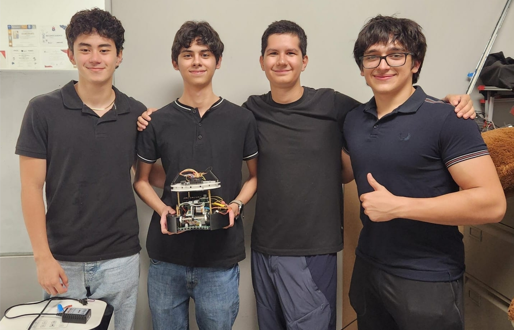

# Soccer Infrared 2026

### Team members
[Eduardo Mateo Murillo Andrade](https://github.com/mate-muri777) - Electronics  
[Luis Alfonzo Ramírez Cepeda](https://github.com/a00842258-design) - Mechanics  
[Andrés Rodríguez Cantú](https://github.com/TEC-Andres) - Programming  
[Aaron Leonardo Flores de León](https://github.com/AaronDeLeon12) - Programming  
[Rodrigo Bahena Sánchez](https://github.com/Bahena05) - Project Manager

### Abstract
Our two robots, **Colibri** and a **Ajolote** autonomously detect an IR-emitting ball, track goals by colour, navigate within field boundaries, and coordinate offensive and defensive roles without any human intervention. The electronics are built around a Teensy 4.1 main controller connected to five custom PCBs, an omnidirectional three-motor drive base, a 14-receiver IR ring for ball tracking, and a Pixy 2.1 camera for goal detection. The codebase is fully modular, using a cosine-based motion library and cascaded moving-average filters for stable sensor readings

Our codebase is modular, organized into libraries for each hardware and software component. Robot movement is made by cosine-based functions. IR ball detection uses as a kernel the width under the pulse wave; to later normalize the angle. Photoresistors analyzes the rate of change between current and previous measurements to be compared to a specific baseline, if it surpasses it, it automatically detects it as if being on line, Likewise, if this were to decrease and surpass this certain threshold, then it will detect it as green.

