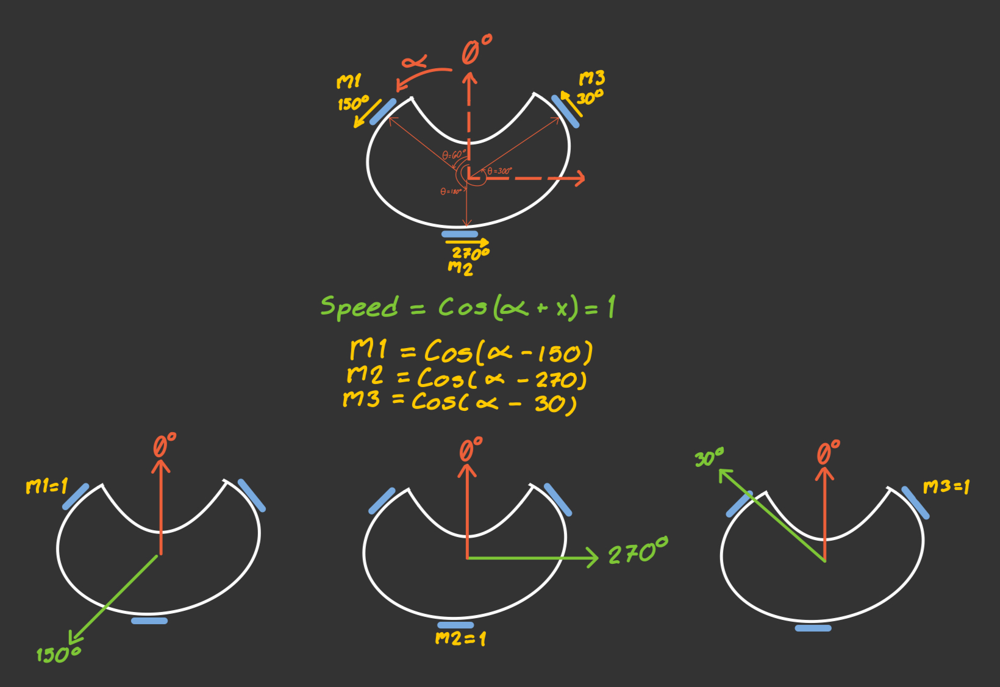

# Motion Control
The robot’s movement system is based on a three-motor omnidirectional base, allowing it to move in any direction without needing to rotate first. This flexibility is crucial for quick responses and smooth navigation in dynamic environments, such as robotic competitions.

## Velocity Equations for an Omnidirectional Base


To obtain the equations that describe the motion of an omnidirectional base, we start by analyzing the velocity components using cosine functions. In this model, the value `1` represents the maximum speed a motor can reach in the forward direction, while `-1` represents the same speed in the opposite direction.

Our motors are placed with an angular separation of 120°, located at 60°, 180°, and 300° with respect to the center of the base. Since the wheels are mounted perpendicular to the axis of each motor, the resulting direction of motion for each wheel (when the motor spins positively) is:

- **Motor m1**: 150°  
- **Motor m2**: 270°  
- **Motor m3**: 30°

To calculate the speed of each motor depending on the desired direction of movement of the robot, we use the following general expression:

$$P_i = v\cos(\theta - \phi_i)$$

Where:

- $\theta$ is the direction we want the robot to move (parameter we'll introduce),
- $\phi_i$ is the direction in which each motor contributes movement (Value we need to find),
- $v$ is the normalized speed of motor, with values between `-1` and `1`.

So, the final speed equations for each motor, based on the desired movement direction $\phi$, are:

$P_1 = v\cos(\theta - 150)$
$P_2 = v\cos(\theta - 270)$
$P_3 = v\cos(\theta - 30)$

These equations tell us how fast each motor should spin to move the robot in a specific direction.

Finally, these normalized values can be multiplied by the linear speed we want for the robot, We used parameters from 0 to 1 to have a standarized code and manage the values of speed in terms of percentage. We can also add an angular speed component, calculated using a PID controller.

To compute each motor’s speed, we use the following method:

```cpp
void Motors::move(float angleDegrees, float speedPercent, float rotationalSpeed) {
    float upper_left_speed = cos((angleDegrees - 150) * PI / 180.0f) * speedPercent + rotationalSpeed;
    float lower_center_speed = cos((angleDegrees - 270) * PI / 180.0f) * speedPercent + rotationalSpeed;
    float upper_right_speed = cos((angleDegrees - 30) * PI / 180.0f) * speedPercent + rotationalSpeed;

    left.setSpeed(-upper_left_speed);
    center.setSpeed(lower_center_speed);
    right.setSpeed(upper_right_speed);
}
```

These speed values are then passed to the `SetSpeed()` method of each motor, which handles the direction and PWM-based speed control:

```cpp
void Motor::setSpeed(float speed) {
    if (speed > 0.0f) {
        speed += GetMotorSpeedOffset(id);
    } else if (speed < 0.0f) {
        speed -= GetMotorSpeedOffset(id);
    }

    speed = constrain(speed, -255.0f, 255.0f);

    if (abs(speed) < 1.0f) {
        analogWrite(pwmPin, 0);
        return;
    }

    if (speed < 0) {
        digitalWrite(in1Pin, LOW);
        digitalWrite(in2Pin, HIGH);
    } else {
        digitalWrite(in1Pin, HIGH);
        digitalWrite(in2Pin, LOW);
    }

    analogWrite(pwmPin, (int)abs(speed));
}
```
Each motor is managed through an H-bridge configuration using two digital pins (in1, in2) for direction and one PWM pin (inPWM) for speed modulation. This allows for precise bidirectional control of each motor.

## PID Controller
As a fundamental part of the robot structure, in order for the robot to be able to score, it needs to be pointing to the right direction. In order to control to where the robot is facing, you need to use the aformentioned `move` method with it's respective rotationalSpeed. This, traditionally has always been done by using a PID.

The formula to calculate the PID for any given function is a classical result from control theory; showing up on this classical form:

$$u(t)=K_p e(t)+ K_i \int_0^t e(\tau) d\tau +K_d \frac{de(t)}{dt}$$

The issue with using this classical result is the fact that sometimes you can land on valleys. If you got a PID that's calibrated high on $P$, on small differences between origin angle and current angle $(\Delta \theta)$, you will overshoot. If we add an $I$ parameter, this should do the trick. However, motors don't move at any PWM values, they need to move at minimum speed, otherwise the robot will literally not move. The result now is that you will not overshoot if you are over a certain large $\Delta \theta$, but you will not arrive if $\Delta \theta$ is small enough. You can try to combat this by increasing $I$, however, now you have the same problem but in reverse. At large $\Delta \theta$ you will overshoot, while at small $\Delta \theta$ you will reach a certain value. It's is plausible to believe that it's just matter of proper calibration, however, there's a linear asymptote that prevents this from happening in the traditional model. Even if it was possible, it would be so sensible to initial conditions, that the second it exited the routine (i.e: when the robot detects line), the $I$ parameter will make the robot move uncontrollably.  

In order to fight this problem, a solution is to add a step function that will only activate if and only if $\Delta \theta$ is inside within a certain domain. 

Such mathematical model can be define in the following fashion by using this piecewise model:

$$\begin{array}{l}
u(t) = \left\{ \begin{array}{ll}
0 & : |e(t)| \le B_{\text{settle}} \\
U_{\text{max}} \cdot \operatorname{sgn}(u_{\text{pid}}(t)) & : |e(t)| > B_{\text{settle}} \text{ and } |u_{\text{pid}}(t)| \ge U_{\text{max}} \\
U_{\text{min}} \cdot \operatorname{sgn}(u_{\text{pid}}(t)) & : |e(t)| > B_{\text{settle}} \text{ and } |u_{\text{pid}}(t)| < U_{\text{min}} \\
u_{\text{pid}}(t) & : \text{otherwise}
\end{array} \right. 
\end{array} $$

The result of using this approach, is that now we are able to use more agressive models, since the deadbands protect us from accidentally losing control. Using this approach, we are able to calibrate our model, as we only really need to calibrate two values $K_p$ and $K_d$, deadbands and limits can be set based on the physical properties of the robot, and the $I$ parameter can be set to zero, since we don't have to worry about landing on valleys.