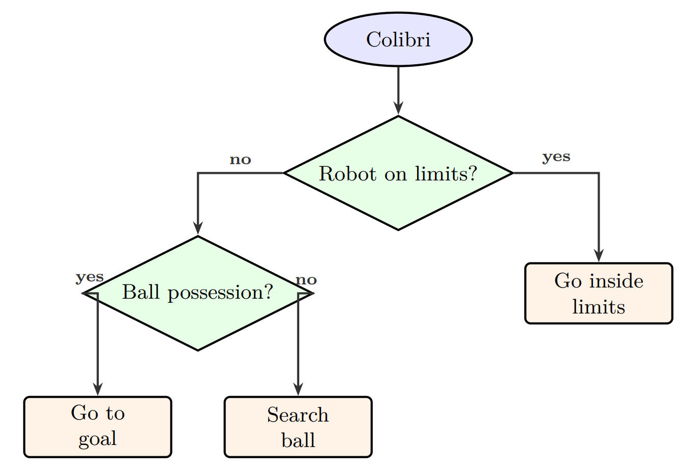
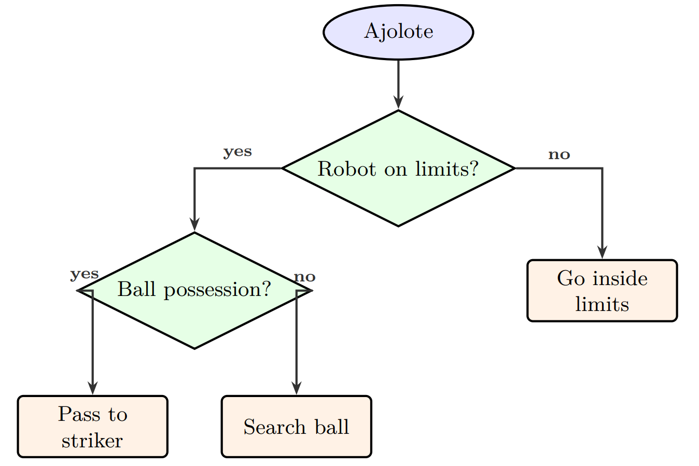

## Colibri

Like the name says our striker is the more jittery, fast and unpredictable robot of the 2, it moves using extremely precise IR calculations and PID orientation using a complex control system to keep it facing forward at all times making "el espacio como d luna llena" be able to carry the ball into the goal

Colibri runs on a loop of checking for line first then checking for PID orientation then checking for IR ball calculated angle and attacking it, finally the robot uses the header PID to angle itself toward the goal whenever its visible using the Pixy as explained in "Pixy libraries and usage" this makes for a very aggresive robot designed to keep the ball on the opponents side and angle itself toward the goal to create more shots on goal and opportunities. 

Its design has flaws like possible own goals in certain situations and moving too fast for the phototransistors to detect the line stopping us from being able to use higher speed from the motors which would allow for much more aggresive play. We can see the workflow of Colibri in the following flowchart:

## Ajolote
Reflecting its name our goalie is smarter and has an exotic style of play, it stays behind without being too conservative or too aggresive.

Ajolote runs on a loop very similar, checking for line first, then checking IR and Pixy to position itself between the goal and the ball and if the ball gets too close it attacks it aggresively but ready to go back as soon as the goal is too far keeping a sort of safe zone to protect our goal from stray balls or from other robots attacking the ball. This is perfectly described with the following flowchart:

