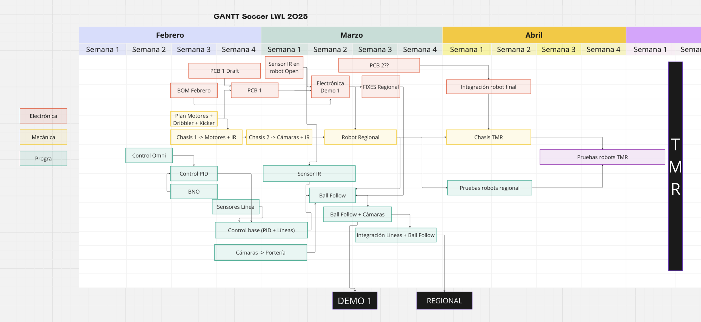
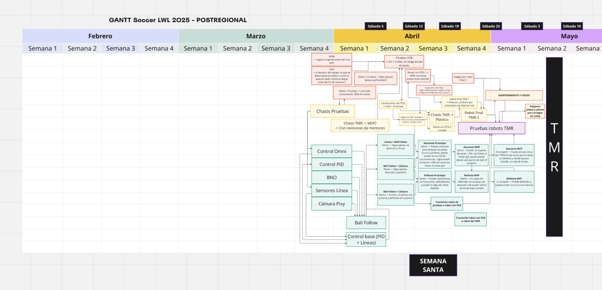
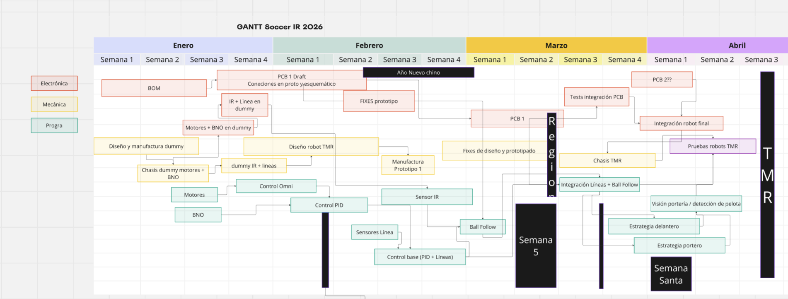
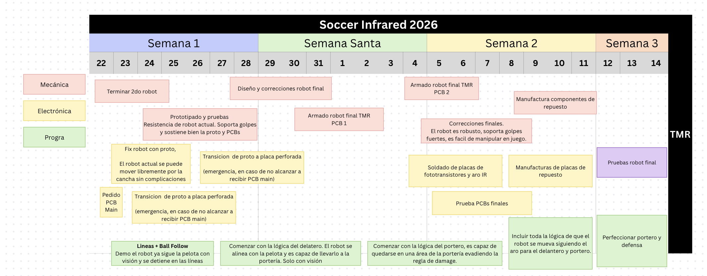

# Project Management

## 2025

### Gantt

## 2026

### Gantt

## Methodology

At the beginning, a workflow was proposed using a Gantt chart based on the previous year's project. The tasks were divided by area so that each team member could have specific objectives. Additionally, two demos were scheduled during the development process to evaluate overall progress, as well as dedicated time at the end of the project for final testing.

## Project Phases

Recommendations on how I believe the project should be organized.

### Competition Introduction ***(November - December)***

During the first phase of the project, team members review the available competition documentation, both from previous internal projects and external resources.

It is very important for the team to create a list of all the questions that arise and for each member to approach the mentor of their respective area to clarify them.

The resources provided to the team were the following:

- [RoBorregos Soccer Lightweight 2023 GitHub](https://github.com/RoBorregos/robocup-soccerlight-2023)
- [RoBorregos Soccer Lightweight 2024 GitHub](https://github.com/RoBorregos/robocup-soccer-light-2024)
- [RoBorregos Soccer Lightweight 2025 GitHub](https://github.com/RoBorregos/Soccer-Lightweight-2025)
- [RoBorregos Soccer Open 2024 GitHub](https://github.com/RoBorregos/robocup-soccer-open-2024)
- [RoBorregos Soccer Open 2025 GitHub](https://github.com/RoBorregos/robocup-soccer-open-2025)
- [RoBorregos Documentation](https://docs.rbrgs.com/)
- [Posters and TDPs RoboCup Brasil 2025](https://github.com/robocup-junior/rcj-soccer-tdp-2025?tab=readme-ov-file)
- [Awesome RoboCup Junior Soccer](https://github.com/robocup-junior/awesome-rcj-soccer?tab=readme-ov-file)
- [RoboCup Junior Soccer Website](https://junior.robocup.org/soccer/)
- [Draft Rules 2026](https://robocup-junior.github.io/soccer-rules/2026-soccer-draft-rules/rules.pdf)
- [Schedule Extension](https://github.com/IvanRomero03/rbrgs-convertidor-horario/tree/main)

### Technical Introduction ***(December - January)***

During this phase, the team begins working with the previous year's robot. The objective is for team members to become familiar with the tools and technologies used in the project. Basic component testing is carried out, along with an initial development approach.

### First Sprint ***(January - February)***

During this phase, the team stops working with the previous year's materials and begins its first iterations. Activities include mechanical prototyping, electronic testing on breadboards, and the development of new programming classes using object-oriented programming.

### Second Sprint ***(February - March)***

Experimental observations are conducted, and based on the results, the team redefines its workflow according to the specifications intended for the competition robot.

### Final Sprint ***(March - End of Project)***

It is very important to allocate enough time to test the final robot and make minor adjustments in order for the team to become fully familiar with the work that will be presented during the competition.

## Extra Considerations

For the project to be successful, team members must maintain good communication and strong team alignment. To achieve this, it is recommended to organize team-building activities at the beginning of the project and formally introduce each member to their respective mentor.

In case issues arise within the team, the strategy I used was to hold individual meetings with each member to better understand their perspective. Additionally, team meetings were organized to help members align with one another and better understand the progress and current state of each participant within the project.