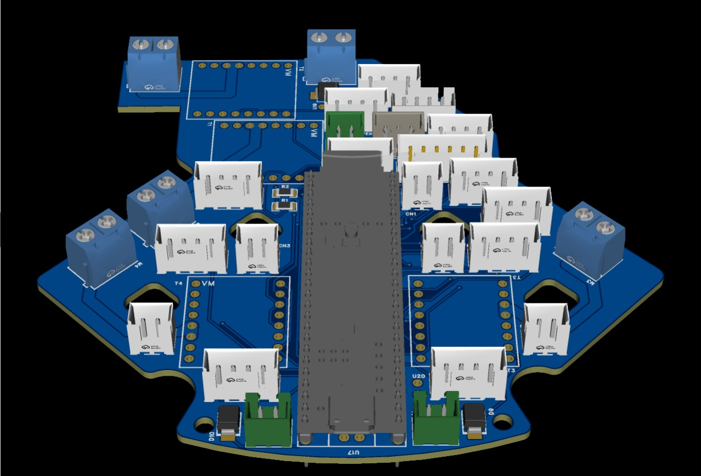
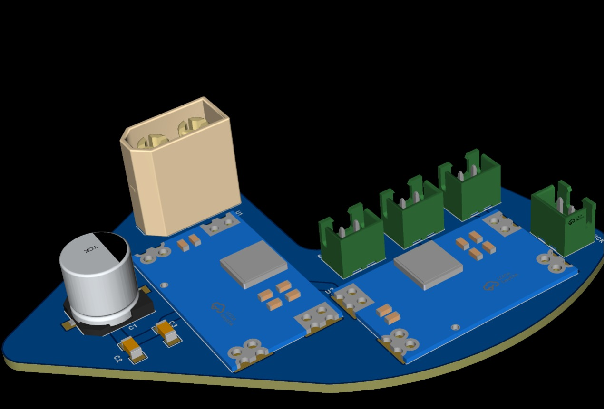
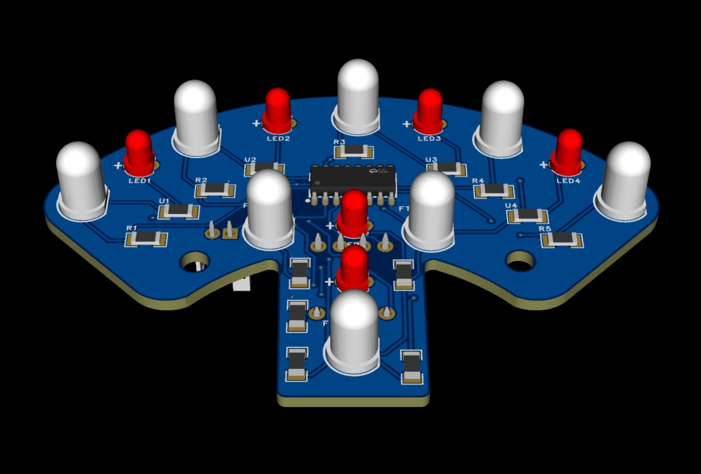

# Electronics
This document details the design, implementation, and testing results of the main electronic systems for a robot project. Each section addresses a critical subsystem—from power distribution to sensor integration—highlighting the challenges encountered during development and the engineering solutions implemented to resolve them. The document also provides recommendations for future design iterations to improve reliability, performance, and scalability. By documenting these lessons learned, the goal is to establish best practices for subsequent versions of the robot and serve as a reference guide for similar projects.

## Main PCB
The main PCB was designed to centralize power distribution, motor control, and robot sensor connections on a single board. During the testing phase, a critical failure occurred at the power input, as the 12V entered through a protection diode and the traces responsible for conducting this current were dimensioned with insufficient thickness. Under load conditions, these traces fractured, causing intermittent power failures and risking the integrity of the board.

### Power Design Recommendations
For future design versions, it is recommended to increase trace width and via diameter on all power lines, considering from the design stage the maximum system current and current spikes generated by the motors.

## Power Supply System
The power supply system was designed to provide stable power to the motor drivers, microcontroller, and sensor system. During testing, failures were detected in the 12V line regulation. The initial design opted to use a capacitor array as a filter to stabilize the power supply; however, this arrangement was physically distant from the TB66FNG drivers, causing the capacitors to directly receive voltage spikes generated by the motors. As a consequence, several controllers were damaged during testing.

### Improved regularion and protection
To solve this problem, an additional voltage regulator was added to the 12V line, strategically placed near the drivers, which allowed eliminating voltage spikes and significantly improving system stability. For future iterations, it is recommended to always place filtering elements as close as possible to inductive loads.

## Signal Reading System 
To optimize the use of microcontroller inputs and enable reading of multiple analog signals from sensors, the 74HC051 multiplexer was integrated. This component allowed switching between different signals using a reduced number of pins, which simplified PCB routing and improved system scalability. Thanks to this multiplexing, it was possible to integrate more sensors without significantly increasing hardware complexity.

### Recommendations
For future iterations, it is recommended to keep analog lines as short as possible to reduce noise, implement additional filtering if the number of sensors increases, and consider multiplexers with lower ON resistance if greater precision is required.

## Line Detection System
The line detection system was designed using optical sensors to reliably identify the white line on the playing field. To achieve complete coverage around the robot, four independent PCBs were developed and placed in a double detection circle, eliminating blind spots without coverage and improving the robot's ability to react to the line from any direction.

### Phototransistor Selection Problem
During testing, important problems emerged related to sensor selection, as the PT331C phototransistor model was used, whose dome-shaped package caused the sensors to constantly scrape against the ground.

### Sensor Reccommendation
It is recommended to migrate to the TEPT5700 phototransistor, which offers greater sensitivity to reflected light, a package more suitable for ground-level applications, greater mechanical durability, and superior overall performance in line detection.

## Resources
In this [Google Drive link](https://drive.google.com/drive/folders/1iLI8nZqHYHWCFtoLrhFHCsU3mt8n4tq5?usp=sharing) you can access all the step files where the PCBs were modeled.