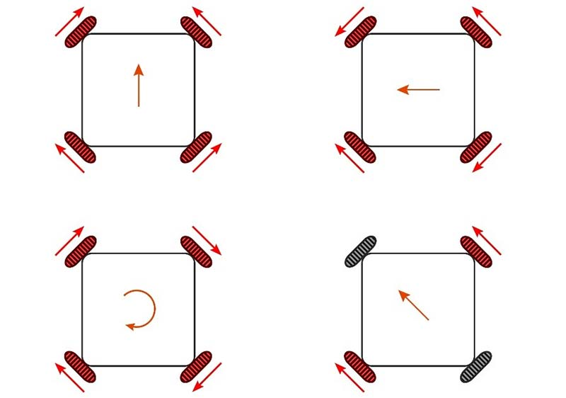

# Control

## Omnidirectional Drive System
An omnidirectional wheel system allows a robot to move in any direction instantly, without needing to rotate first. In a standard four-wheel configuration, each wheel is placed at 90° from one another. However, in this robot the four omni wheels were positioned asymmetrically — alternating separation angles of 75° and 105° — to optimize physical space between the wheels and improve the overall mechanical layout. While this decision benefits the structural design, it introduces additional complexity in the motion control programming, as the standard kinematic equations for symmetric configurations no longer apply directly and must be adapted to account for the irregular angle distribution.

## Motor Mapping
To address this, the drive control was developed by deriving a custom inverse kinematic model that maps the desired robot velocity — in the X axis, Y axis, and rotation — to the individual speed required by each wheel, considering the actual angular position of each one. The wheel angles used in the model are 322.5°, 37.5°, 142.5°, and 217.5° for the front-left, front-right, back-right, and back-left wheels respectively.

Here is a general mapping of a 4 omniwheel robot that will help you understand how the direction of the wheels drive the direction of the robot.

## Recommendations
It is very likely that the control of the robot will have alterations along the mechanical and electronics iterations. Before having a stable version, do not get too comfortable with your configuration or tuning the movement of the robot. Create a simple workflow to check that all wheels are spinning correctly after an iteration is made in the robot. It is recommended to use PlatformIO environments as a tool to speed up this process.

