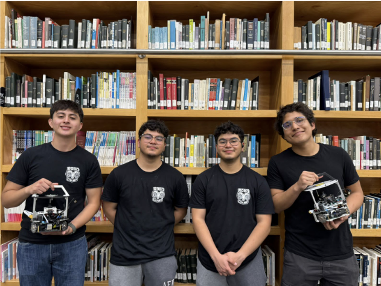
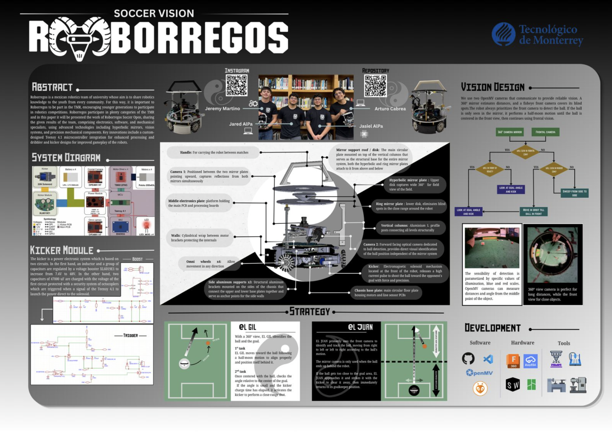

# Soccer Open 2026
Team Members:

- Jeremy Martino - Mechanics
- Jared Aldana - Programmer
- Jasiel Aldana - Electronics
- Arturo Cabrera - Programmer

## Abstract

Our robot has been designed to optimize the space and resistance. Our robot is designed in modularity and flexibility. It also has a robust design that allows them to resist unintended crashes that could occur during matches. We were highly inspired by the white and black visuals looking for a clean and professional look. While also adding a bit of Mexican culture to the traditional ying-yang.

## Areas

- [Programming](Programming/General.md)
- [Mechanics](Mechanics/General.md)
- [Electronics](Electronics/General.md)