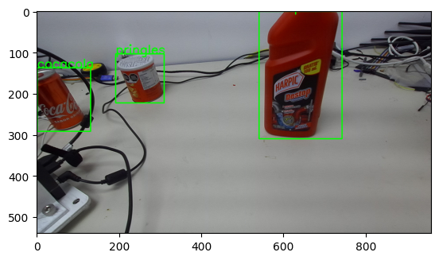

# TensorFlow Lite Model Maker

The TensorFlow Lite Model Maker is a library that simplifies the process of training a TensorFlow Lite model using transfer learning. It's very simple to use and it's very useful for a fast prototyping of a model. 

The Object Detection Module of Model Maker, has different EfficientNet versions

## Enviroment
The requirements of the TensorFlow Lite Model Maker could be difficult to reproduce in different enviroments. To avoid this, we recommend to use the Dockerfile developed in the proyect: [Dockerfile](https://github.com/RoBorregos/model-maker-dnn/blob/main/Dockerfile)

## Usage
As mentioned before, the TensorFlow Lite Model Maker is very simple to use. The following steps are the ones that we used to train a model for the Object Detection Module:

### Dataset
The dataset must be in a CSV format, with the following columns format (without headers):
```csv
Usage, Path, Label, XMin, XMax, , , YMin, YMax
```
Sample annotation: 
```
TEST,dataset/test_set/0.jpg,pringles,0.1572265625,0.00390625,,,0.2587890625,0.15885416666666666
```

### Training

Import the required libraries:
```python
import numpy as np
import tensorflow as tf
from tflite_model_maker import model_spec
from tflite_model_maker import object_detector
```

Set Logging Level:
```python
tf.get_logger().setLevel('ERROR')
from absl import logging
logging.set_verbosity(logging.ERROR)
```

Load the dataset:
```python
train_data, validation_data, test_data = object_detector.DataLoader.from_csv('dataset.csv')
```

Set the model specification:
```python
spec = model_spec.get('efficientdet_lite4')
```

Train the model:
```python
model = object_detector.create(train_data, model_spec=spec, batch_size=8, epochs=100, train_whole_model=True, validation_data=validation_data)
```

Evaluate the model:
```python
model.evaluate(test_data)
```

Export the model:
```python
model.export(export_dir='.')
```
You could especify the export method for the model in other formats, like TFLite or SavedModel:

TFLite:
```python
model.export(export_dir='.', tflite_filename='model.tflite', quantization_config=QuantizationConfig.for_float16(), export_format=[ExportFormat.TFLITE])
```

SavedModel:
```python
model.export(export_dir='.', export_format=[ExportFormat.SAVED_MODEL, ExportFormat.LABEL])
```

Sample results:

