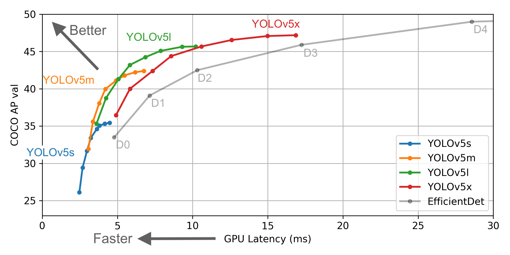

# YOLOv5

YOLOv5 is a recent model developed by Ultralytics. It is a simple use, fast and accurate object detection model. It also allows for training with different weights, which enables the user to choose their model size and resource cost.

## Enviroment
Enabling CUDA capabilities for both running the models and training them can be conflicting with most environments. Ultralytics has provided a CUDA compatible dockerfile over which both inference and training can be easily performed. 
```
sudo docker pull ultralytics/yolov5:latest
```
### Run with GPU support
The following command will enable both GPU support (without any further setup) and will mount the current terminal directory, so it can access user files for both detect and training results to be accessed and stored.

```
docker run --ipc=host -it --gpus all -v $(pwd):/usr/src/app ultralytics/yolov5:latest
```

To use a specific GPU device:
```
docker run --ipc=host -it --gpus device=1 -v $(pwd):/usr/src/app ultralytics/yolov5:latest
```

## Usage
The YOLOv5 repository from ultralytics has an extensive documentation on detecting and training. It also provides python scripts that allow for easy training and detection tests. To train a model on YOLOv5:

### Dataset
Datasets for training have a specific [format](https://roboflow.com/formats/yolov5-pytorch-txt) that consists of a folder with the following structure:
```{bash}
Dataset
│   data.yaml
└─── train
│   └─── images
|   |      image1.png
|   |      image2.png
|   |      ...
|   └───labels
|          image1.txt
|          image2.txt
|          ...
└─── test
|       ...
└─── validate
        ...
```
Where data.yaml contains the information regarding the number of classes, names and identifiers of each class and the locations of the train, test and validation folders. It follows the structure (assuming names of folders as the above example):
```yaml
names:
- nameofclass1
- nameofclass2
...
nc: (numberofclasses)
test: ../test/images
train:  ../train/images
val: ../validate/images

```
The annotations for each image labels are contained within the .txt file of the same name, in the labels folder, using the following format:

```
0 x_center y_center width height
```
Where all four values from the bounding boxes are given in percentage (decimal) of their position in the image, not in pixels.

Sample annotation:
```
5 0.4830163043478261 0.303125 0.020380434782608696 0.07291666666666667
```

### Training

Training on YOLOv5 is done with a single python script that accepts several arguments regarding its cofiguration and the dataset used for it.  For this, 
the YOLOv5 repository has to be cloned locally:
```
git clone  https://github.com/ultralytics/yolov5
```
Then, mount the docker image on a folder with access to the repository, and cd to the yolov5 folder. The train.py script has many arguments to be edited, but the recommended ones are shown on the following sample command:
```
python train.py --img 640 --batch 16 --epochs 300 --data $(pwd)/pathToDataset/dataset1/data.yaml --weights yolov5m.pt --name trainTest --cache --patience 50
```
This script sets the recommended image and batch sizes, and allows both for a maximum of 300 epochs and the patience (how many epochs without accuracy improvement will be allowed) on 50. The --data should be the location of the data.yaml file located inside the dataset, structured accordingly to the previous section. 

The weights of the model will define the size of the trained model's file, as well as the requirements it will ask for the computer on which the inference will run. The repository currently has 6 default weights that can be used:
```
yolov5n.pt NANO
yolov5s.pt SMALL
yolov5m.pt MEDIUM
yolov5l.pt LARGE
yolov5x.pt EXTRA LARGE
```
With the following precision and speed each:

With testing, yolov5m has proven of enough accuracy while occupying less than 2GB of VRAM allocated on runtime.

After training has finished, it will create a new folder on runs/train. There the created models will be contained on the weights folder, including the one generated on the last epoch of the training and the one with the best average precision. The folder will also include the results statistics in a graphical and as a CSV file.

To validate and test the model, it is recommended to use the tutorial.ipynb notebook, which already contains the commands to run both the detect.py and validate.py scripts. Both will generate folders on /runs with the results.

Sample results:


Detection was made using the YOLO ROS Wrapper available at:
```
git clone https://github.com/mats-robotics/yolov5_ros.git
```