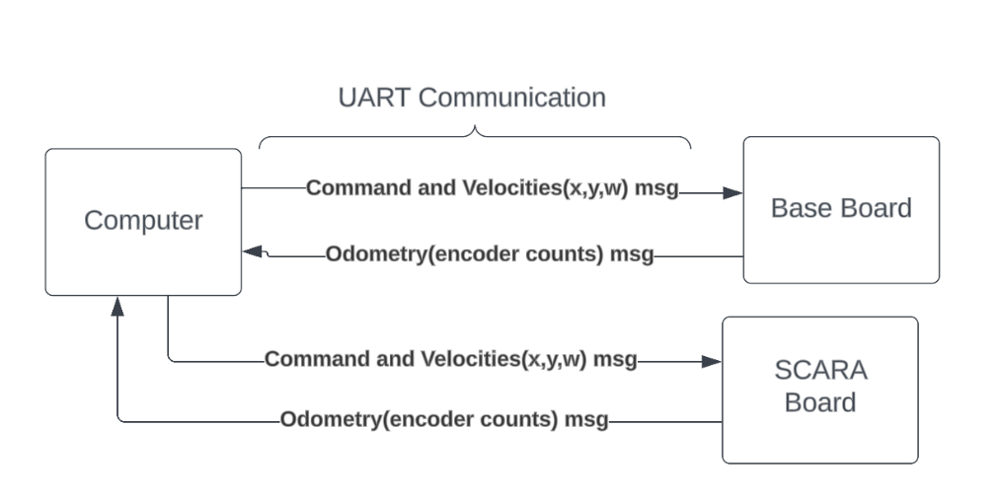

# Control
On the this side, we mainly develop reliable control, for the basic movements of the robot, so that the software developers can access easily to this features of the robot.

First of all we need to explain the communication between the main computer and the microcontrollers. We can understand it more easy with these diagram:

