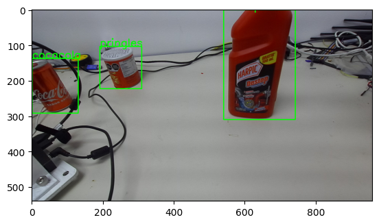

# YOLOv5

YOLOv5 is a recent model developed by Ultralytics. It is a simple use, fast and accurate object detection model. It also allows for training with different weights, which enables the user to choose their model size and resource cost.

## Enviroment
Enabling CUDA capabilities for both running the models and training them can be conflicting with most environments. 

## Usage
As mentioned before, the TensorFlow Lite Model Maker is very simple to use. The following steps are the ones that we used to train a model for the Object Detection Module:

### Dataset
The dataset must be in a CSV format, with the following columns format (without headers):
```csv
Usage, Path, Label, XMin, XMax, , , YMin, YMax
```
Sample annotation: 
```
TEST,dataset/test_set/0.jpg,pringles,0.1572265625,0.00390625,,,0.2587890625,0.15885416666666666
```

### Training

Import the required libraries:
```python
import numpy as np
import tensorflow as tf
from tflite_model_maker import model_spec
from tflite_model_maker import object_detector
```

Set Logging Level:
```python
tf.get_logger().setLevel('ERROR')
from absl import logging
logging.set_verbosity(logging.ERROR)
```

Load the dataset:
```python
train_data, validation_data, test_data = object_detector.DataLoader.from_csv('dataset.csv')
```

Set the model specification:
```python
spec = model_spec.get('efficientdet_lite4')
```

Train the model:
```python
model = object_detector.create(train_data, model_spec=spec, batch_size=8, epochs=100, train_whole_model=True, validation_data=validation_data)
```

Evaluate the model:
```python
model.evaluate(test_data)
```

Export the model:
```python
model.export(export_dir='.')
```
You could especify the export method for the model in other formats, like TFLite or SavedModel:

TFLite:
```python
model.export(export_dir='.', tflite_filename='model.tflite', quantization_config=QuantizationConfig.for_float16(), export_format=[ExportFormat.TFLITE])
```

SavedModel:
```python
model.export(export_dir='.', export_format=[ExportFormat.SAVED_MODEL, ExportFormat.LABEL])
```

Sample results:


