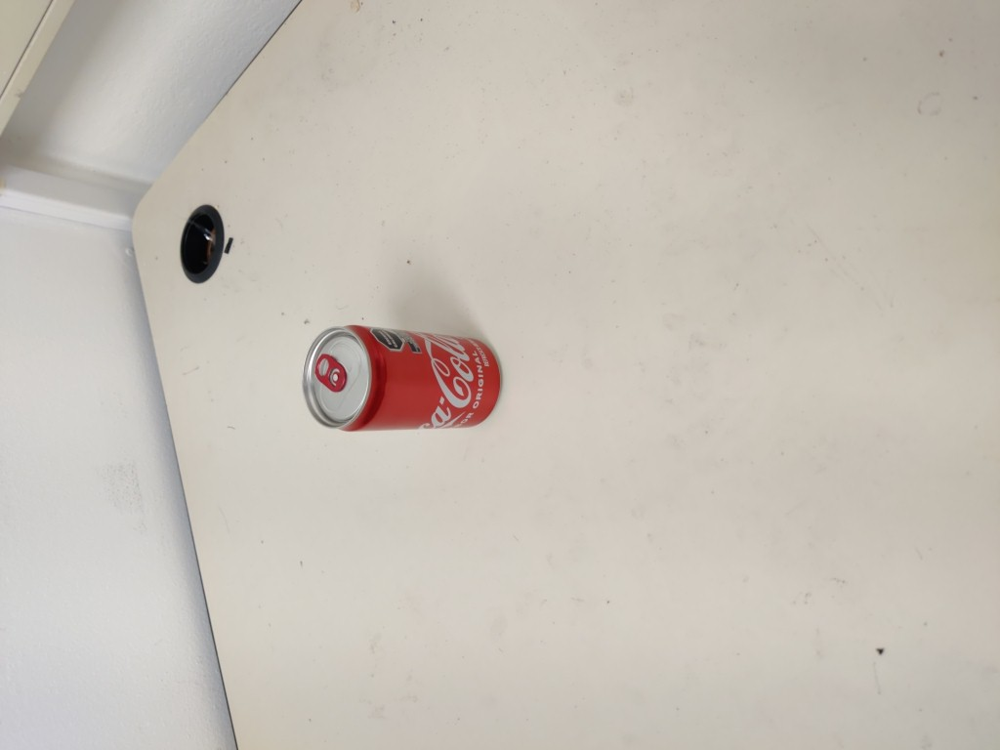
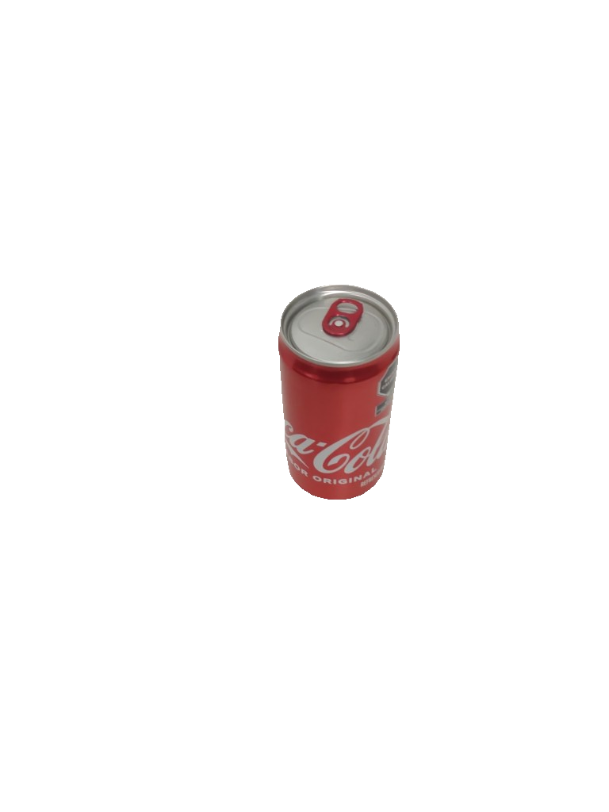
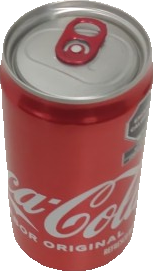
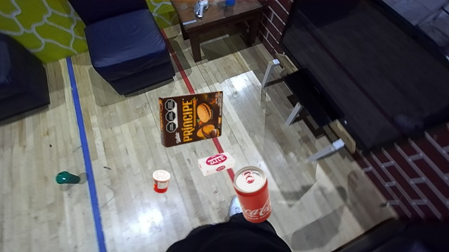
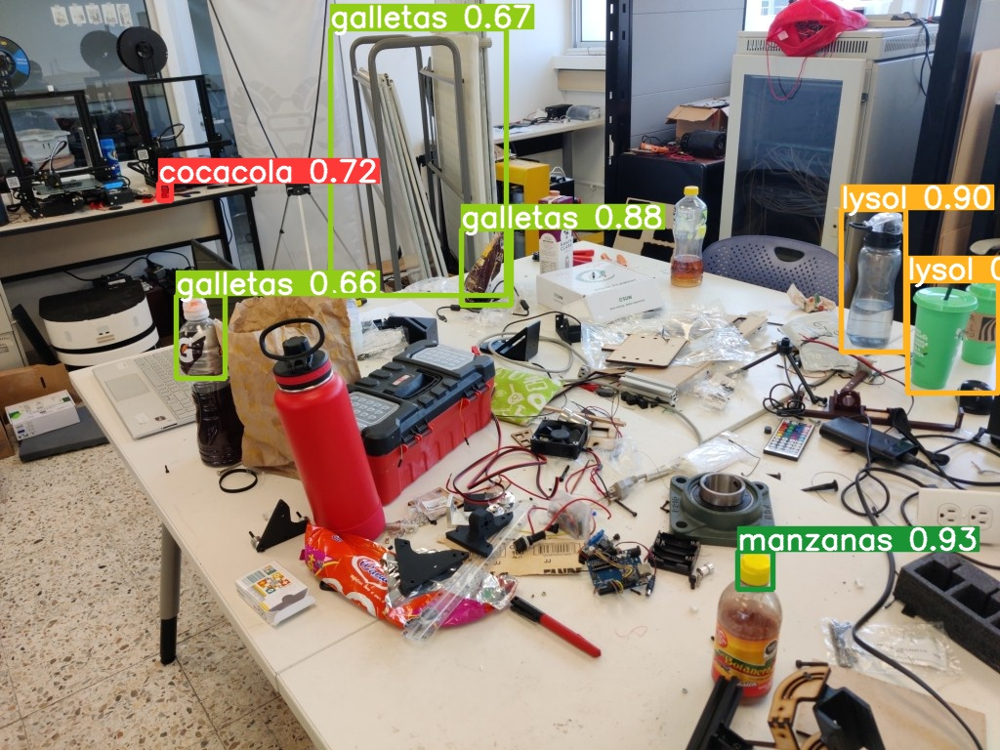
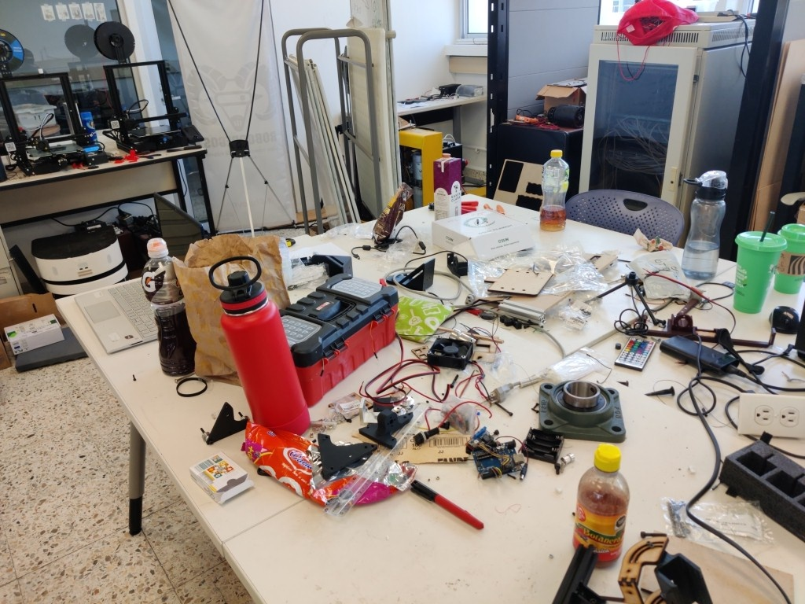

# Dataset Automatization

Dataset generation is the process of collecting and labelling the images according to the objects the detection model will be trained for. It is a slow and often tedious process, as not only hundreds or thousands of images have to be taken, but the labelling process is even slower, and it becomes more difficult as the number of objects or precision objectives increase.

## Solution concept

The solution implemented for the 2023 @Home competition was to automatize both the generation of images and their labelling, both for object detection and segmentation. 

This process consists of:

- Taking images of the objects the model will be trained for, ideally on as many angles and environmental conditions as possible. 
- Extracting the objects from their background, producing a dataset of PNG backgroundless images for every object to be detected.
- Inserting the objects on a dataset of backgrounds (both manually taken and/or from random datasets), using image augmentation to generate as many variations of the objects and their surroundings as possible (color correction, size, obstructions, rotation)
- Saving the position where the objects are inserted to autogenerate the labelling information alongside the whole dataset.
- Exporting the dataset to the desired format, according to the training model to be used.

## Object dataset

Object images taken should have the object on clear and full view, and effort should be taken to get as many angles and environmental conditions (like lightning conditions, color temperature, shadows) as possible. The scripts used during 2023 @Home competion are available at:

```
git clone https://github.com/EmilianoHFlores/synthDataset.git
```

With the scripts provided in the dataset, the object is cut to be used for the creation of the synthetic dataset. 

- First the image is detected using available YOLOv5 models (which remains one of the most important improvements to be made, as some objects could prove difficult to find an adequate model to be detected). Then the object is segmented and cut using the Segment-anything model from META. 



After cut:



With this photo, the object remains at its original position in the image (which can also be used as labels for training with real images).

- Then, the image is cut to the object size, which will be the one used in the creation of datasets.



## Dataset creation

Using a dataset of various backgrounds (including the area of the competition and random datasets obtained online), the notebook included in the repository constructs the dataset inserting the images from all the classes stated on it. 

It then exports it in a format readable for the training models, currently with a version exporting annotations as a COCO json format and in the YOLOv5 one. The notebook exports the COCO format with segmentation, so it can be used with models that support training with segmentation labels.

Example of an image produced:


Segmentation visualized:


## Results Obtained
While images from the datasets created may sometimes look curious and the objects shown on positions and places they would never be found, this process was shown to be succesful to a great extent. An example of this was how one of the first models was trained, on which only backgrounds from the table the model was going to be detecting on were used. The results of this model, while accurate on that space, struggled on other areas:



After retraining with a dataset using diverse backgrounds (both taken from the work area and others), this problem was mostly solved:
