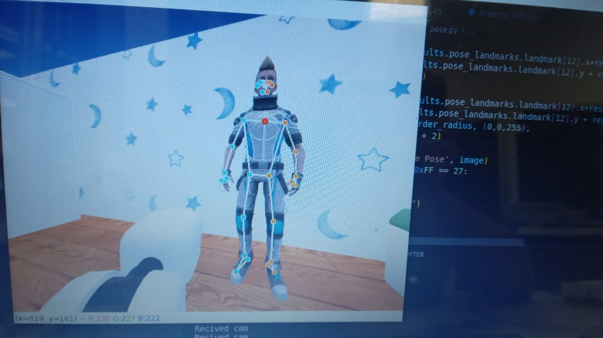

# Pose Estimation with MediaPipe

Pose estimation was implemented using MediaPipe for the RoboCup 2022 @Home Simulation competition. The pose estimation algorithm is based on the [MediaPipe Pose](https://google.github.io/mediapipe/solutions/pose) solution. 

It's very simple, acurate and fast. It's also very easy to use, since it's a pre-trained model that can be used directly.

## How to use it

First of all, you need to install MediaPipe. You can do it by running the following command:

```{bash}
pip install mediapipe
```

Then, you can use the following code to get the pose estimation:

```{python}
import mediapipe as mp

# Calling the pose solution from MediaPipe
mp_pose = mp.solutions.pose

# Opening the image source to be used
image = cv2.imread("image.jpg")

# Calling the pose detection model
with mp_pose.Pose(
        min_detection_confidence=0.5,
        min_tracking_confidence=0.5) as pose:
    # Detecting the pose with the image
    poseResult = pose.process(image)
```

As a result, you'll have a `poseResult` array of points. That each point represent a joint of the body, as shown in the following image:


### Using pose estimation with webcam

You can also use pose estimation with a webcam to get streamed video. You can use the following code to do it:

```{python}
import mediapipe as mp

import cv2

# Calling the pose solution from MediaPipe
mp_pose = mp.solutions.pose

# Calling the solution for image drawing from MediaPipe
mp_drawing = mp.solutions.drawing_utils
mp_drawing_styles = mp.solutions.drawing_styles


# Opening the webcam
cap = cv2.VideoCapture(0)

# Calling the pose detection model
with mp_pose.Pose(
        min_detection_confidence=0.5,
        min_tracking_confidence=0.5) as pose:
    # Looping through the webcam frames
    while cap.isOpened():
        # Reading the webcam frame
        success, image = cap.read()
        if success:

            # Managing the webcam frame
            image.flags.writeable = False
            image = cv2.cvtColor(image, cv2.COLOR_BGR2RGB)

            # Detecting the pose with the image
            results = pose.process(image)

            # Drawing the pose detection results
            image.flags.writeable = True
            image = cv2.cvtColor(image, cv2.COLOR_RGB2BGR)
            mp_drawing.draw_landmarks(
                image,
                results.pose_landmarks,
                mp_pose.POSE_CONNECTIONS,
                landmark_drawing_spec=mp_drawing_styles.get_default_pose_landmarks_style())
            cv2.imshow('MediaPipe Pose', cv2.flip(image, 1))
            if cv2.waitKey(5) & 0xFF == 27:
                break
cap.release()
```

As a result, you'll not only be able to get the pose estimation array. but also the stream with the drawing of the pose estimation.

Example:


### Using pose estimation with ROS

You can receive the image source from a ROS topic. You can use the following code to do it:

```{python}
import mediapipe as mp
from time import sleep
from typing import Tuple
import cv2
import numpy as np
import rospy
from cv_bridge import CvBridge
from sensor_msgs.msg import Image

# Calling the pose solution from MediaPipe
mp_pose = mp.solutions.pose

# Calling the solution for image drawing from MediaPipe
mp_drawing = mp.solutions.drawing_utils
mp_drawing_styles = mp.solutions.drawing_styles

# Declaring the CvBridge for image conversion from ROS to OpenCV
bridge = CvBridge()

# Declaring the image and its callback for the ROS topic
imageReceved = None
def image_callback(data):
    global imageReceved
    imageReceved = data

# Initializing the ROS node
rospy.init_node('ImageRecever', anonymous=True)

# Subscribing to the ROS topic
imageSub = rospy.Subscriber(
    "/hsrb/head_center_camera/image_raw", Image, image_callback)

# Calling the pose detection model
with mp_pose.Pose(
        min_detection_confidence=0.5,
        min_tracking_confidence=0.5) as pose:
    # Looping through the image frames
    while not rospy.is_shutdown():
        if imageReceved is not None:
            # Converting the ROS image to OpenCV
            image = bridge.imgmsg_to_cv2(imageReceved, "rgb8")

            # Detecting the pose with the image
            image.flags.writeable = False
            results = pose.process(image)

            # Drawing the pose detection results
            image.flags.writeable = True
            image = cv2.cvtColor(image, cv2.COLOR_RGB2BGR)
            mp_drawing.draw_landmarks(
                image,
                results.pose_landmarks,
                mp_pose.POSE_CONNECTIONS,
                landmark_drawing_spec=mp_drawing_styles.get_default_pose_landmarks_style())


            cv2.imshow('MediaPipe Pose', image)
            if cv2.waitKey(5) & 0xFF == 27:
                break
        else:
            print("Image not recived")
        sleep(1)

```

Here is an example of the result:



