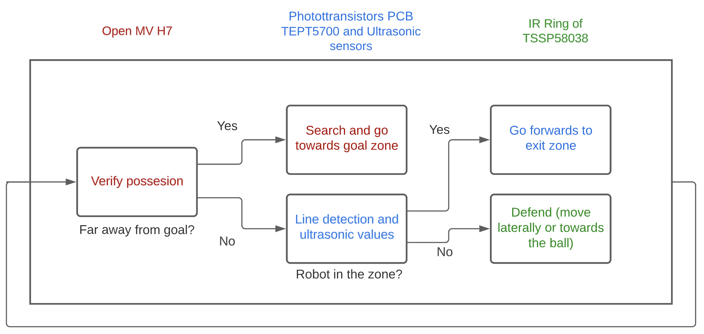

# General

## Tools
The main tools used to program the robot are:

- Arduino CLI (Command based interface)
- Visual Studio Code (IDE)
- OpenMV IDE (IDE used to program the OpenMV camera)

#
## Strategy
During the regional competition we decided to have two attacking robots which had the same code due to time issues and other setbacks. Nonetheless, we learned that this was not a very good strategy, since both robots would sometimes crash with each other when searching for the ball, making scoring very difficult. Therefore, for the national competition we chose the strategy of developing an attacking and a defending robot. Ideally both robots would be able to change roles during the game, however the defending robot had the camera facing backwards, so this was not possible.

It is also important to mention that the structure of the code worked as a state machine, advancing to different states until the previous one was completed. This was necessary since it was immportant to keep certain priorities. For example, for the attacking robot, it should first check that it isn't on a line before doing anything else.

## Algorithm
### Attacking Robot
The main objective of this robot was to gain possesion of the ball using the dribbler as fast as possible and then go towards the goal using vision. Therefore, the algorithm used is the following:

### Defending Robot
On the other hand, the defending robot should always stay near the goal and go towards it if the ball is in a 20cm radius. The algorithm for this robot is shown in the following image:

